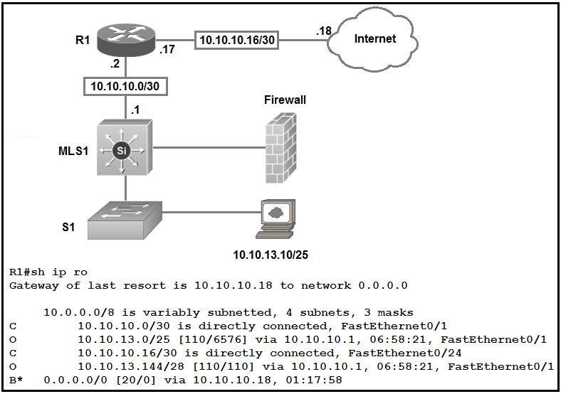

# CCNA Personal Note 

## Original book - AI analysis - Summarize 

## Chapter 1: Introduction to TCP/IP Networking 

- Networking Models as Blueprints: Networking models are like architectural blueprints for networks. They provide structure, standards, and protocols to ensure network devices and software work together correctly. 

- Standards and Protocols: Networks operate based on rules called standards and protocols, which are agreements on how specific parts of a network should function. 

- TCP/IP Model Dominance: TCP/IP is the most pervasive networking model today, supported by almost every OS and heavily emphasized in the CCNA exam. 

- TCP/IP Model Layers (5-Layer Model for CCNA):

1. Physical Layer: Focuses on transmitting bits over a physical link (cabling, connectors, electrical signals, light). 

2. Data Link Layer: Focuses on sending data over a single type of physical link (e.g., Ethernet LAN, Wireless LAN). Defines data-link protocols like Ethernet, PPP.

3. Network Layer (Internet Layer in TCP/IP): Focuses on delivering data across the entire path from source to destination computer, potentially across multiple networks. Key protocol: IP (Internet Protocol). Handles addressing and routing.

4. Transport Layer: Provides services to applications running above it, like reliable data delivery (TCP) and connectionless delivery (UDP). Error recovery (TCP) is a key service.

5. Application Layer: Provides services directly to application software (e.g., web browsers, email clients). Defines protocols like HTTP, SMTP, DNS.

- TCP/IP and the "Real World": Vendors implement TCP/IP in hardware (NICs) and software (Operating Systems) to enable networking.

HTTP Example (Application Layer):

Web browser (Bob) requests a web page from a web server (Larry) using HTTP.

Request includes an HTTP header (e.g., "GET home.htm").

Server responds with HTTP header (e.g., "OK 200") and data (web page content).

- TCP Error Recovery (Transport Layer): TCP provides reliable data delivery by using acknowledgments and sequence numbers to detect and retransmit lost data.

- Adjacent-Layer Interaction: Layers in the model interact vertically. A higher layer (e.g., HTTP) uses services provided by the layer below it (e.g., TCP).

- Same-Layer Interaction: Layers on different computers communicate horizontally using headers to exchange information defined by the protocol of that layer (e.g., TCP headers with sequence numbers).

- IP Addressing and Routing (Network Layer):

IP addresses are unique identifiers for devices on a TCP/IP network (like postal addresses).

Routers act like postal offices, forwarding IP packets based on destination IP addresses to ensure delivery.

IP addresses are grouped into networks and subnets, similar to postal codes.

- Data Encapsulation: The process of adding headers (and trailers at the data-link layer) from each layer as data moves down the TCP/IP model for transmission.

- Application Layer Data -> Transport Layer Header -> Network Layer Header -> Data Link Layer Header & Trailer -> Physical Layer Transmission.

- Data Encapsulation Terminology:

        1. Segment: Transport layer message.

        2. Packet: Network layer message (IP packet).

        3. Frame: Data link layer message (Ethernet frame).

        4. PDU (Protocol Data Unit): Generic term for messages at different layers in the OSI model.

- OSI (Open Systems Interconnection) Model:

        1. A 7-layer networking model developed by ISO.

        2. Did not become the dominant model like TCP/IP, but OSI terminology is still widely used.

        3. OSI Layers (7 Layers):

                a. Physical

                b. Data Link

                c. Network

                d. Transport

                e. Session

                f. Presentation

                g. Application

        4. Lower 4 OSI layers roughly map to TCP/IP layers with the same names and similar functions.

        5. OSI numbering is often used when referring to TCP/IP layers (e.g., "Layer 7 protocol").

        6. OSI also uses PDU terminology (Layer 1 PDU, Layer 2 PDU, etc.) for encapsulation.

Here's a comprehensive summary of Chapters 1-3 from your CCNA study material, designed to help you prepare for your exam:

**Part I: Introduction to Networking - Key Summary**

**Chapter 1: Introduction to TCP/IP Networking**

*   **Networking Models as Blueprints:**  Networking models are like architectural blueprints for networks. They provide structure, standards, and protocols to ensure network devices and software work together correctly.
*   **Standards and Protocols:** Networks operate based on rules called standards and protocols, which are agreements on how specific parts of a network should function.
*   **TCP/IP Model Dominance:** TCP/IP is the most pervasive networking model today, supported by almost every OS and heavily emphasized in the CCNA exam.
*   **TCP/IP Model Layers (5-Layer Model for CCNA):**
    *   **Physical Layer:**  Focuses on transmitting bits over a physical link (cabling, connectors, electrical signals, light).
    *   **Data Link Layer:** Focuses on sending data over a *single* type of physical link (e.g., Ethernet LAN, Wireless LAN). Defines data-link protocols like Ethernet, PPP.
    *   **Network Layer (Internet Layer in TCP/IP):** Focuses on delivering data across the *entire path* from source to destination computer, potentially across multiple networks.  Key protocol: IP (Internet Protocol). Handles addressing and routing.
    *   **Transport Layer:** Provides services to applications running above it, like reliable data delivery (TCP) and connectionless delivery (UDP). Error recovery (TCP) is a key service.
    *   **Application Layer:** Provides services directly to application software (e.g., web browsers, email clients). Defines protocols like HTTP, SMTP, DNS.
*   **TCP/IP and the "Real World":**  Vendors implement TCP/IP in hardware (NICs) and software (Operating Systems) to enable networking.
*   **HTTP Example (Application Layer):**
    *   Web browser (Bob) requests a web page from a web server (Larry) using HTTP.
    *   Request includes an HTTP header (e.g., "GET home.htm").
    *   Server responds with HTTP header (e.g., "OK 200") and data (web page content).
*   **TCP Error Recovery (Transport Layer):** TCP provides reliable data delivery by using acknowledgments and sequence numbers to detect and retransmit lost data.
*   **Adjacent-Layer Interaction:**  Layers in the model interact vertically. A higher layer (e.g., HTTP) uses services provided by the layer below it (e.g., TCP).
*   **Same-Layer Interaction:** Layers on different computers communicate horizontally using headers to exchange information defined by the protocol of that layer (e.g., TCP headers with sequence numbers).
*   **IP Addressing and Routing (Network Layer):**
    *   IP addresses are unique identifiers for devices on a TCP/IP network (like postal addresses).
    *   Routers act like postal offices, forwarding IP packets based on destination IP addresses to ensure delivery.
    *   IP addresses are grouped into networks and subnets, similar to postal codes.
*   **Data Encapsulation:**  The process of adding headers (and trailers at the data-link layer) from each layer as data moves down the TCP/IP model for transmission.
    *   Application Layer Data -> Transport Layer Header -> Network Layer Header -> Data Link Layer Header & Trailer -> Physical Layer Transmission.
*   **Data Encapsulation Terminology:**
    *   **Segment:** Transport layer message.
    *   **Packet:** Network layer message (IP packet).
    *   **Frame:** Data link layer message (Ethernet frame).
    *   **PDU (Protocol Data Unit):** Generic term for messages at different layers in the OSI model.
*   **OSI (Open Systems Interconnection) Model:**
    *   A 7-layer networking model developed by ISO.
    *   Did not become the dominant model like TCP/IP, but OSI terminology is still widely used.
    *   **OSI Layers (7 Layers):**
        1.  Physical
        2.  Data Link
        3.  Network
        4.  Transport
        5.  Session
        6.  Presentation
        7.  Application
    *   Lower 4 OSI layers roughly map to TCP/IP layers with the same names and similar functions.
    *   OSI numbering is often used when referring to TCP/IP layers (e.g., "Layer 7 protocol").
    *   OSI also uses PDU terminology (Layer 1 PDU, Layer 2 PDU, etc.) for encapsulation.

**Chapter 2: Fundamentals of Ethernet LANs**

*   **LANs and WANs:**
    *   **LAN (Local Area Network):** Connects devices in a close proximity (room, building, campus). Typically uses Ethernet or Wireless LAN (Wi-Fi).
    *   **WAN (Wide Area Network):** Connects devices over larger distances (cities, countries).
*   **Ethernet LANs:**
    *   Dominate wired LAN technology.
    *   Defined by IEEE 802.3 standards.
    *   Use Ethernet cables (often copper UTP, but also fiber optic).
    *   **Ethernet LAN Components:**
        *   **Ethernet Switch:** Central device in a modern Ethernet LAN. Provides ports for connecting devices and forwards frames based on MAC addresses.
        *   **Ethernet Cables:** UTP copper cables (Cat5e, Cat6, etc.) or fiber optic cables.
        *   **Ethernet NIC (Network Interface Card):** In computers and other devices, provides the Ethernet port.
*   **SOHO (Small Office/Home Office) LANs:** Simple LANs often using a "wireless router" which integrates router, switch, and wireless access point functionality.
*   **Enterprise LANs:** Larger, more complex LANs with multiple switches per floor, distribution switches, and wireless LAN access points.
*   **Ethernet Physical Layer Standards Variety:** Many standards for different speeds, cable types, and distances.
    *   **Examples (Table 2-2):** 10BASE-T, 100BASE-T, 1000BASE-T, 1000BASE-LX, 10GBASE-T.
    *   **UTP (Unshielded Twisted Pair) Copper Cabling:** Common and cost-effective for shorter distances (typically up to 100m).
    *   **Fiber Optic Cabling (Multimode and Single-mode):** Used for longer distances, higher bandwidth, and better immunity to EMI. More expensive.
*   **Ethernet Data-Link Layer Consistency:** Regardless of physical layer, Ethernet uses the same data-link layer protocol, frame format, header, and trailer.
*   **Ethernet Frame Format (Figure 2-19):**
    *   **Preamble & SFD:** Synchronization.
    *   **Destination MAC Address:** Recipient's MAC address.
    *   **Source MAC Address:** Sender's MAC address.
    *   **Type/EtherType:**  Indicates the protocol of the data inside the frame (e.g., IPv4, IPv6).
    *   **Data & Pad:** Payload (IP packet) and padding to meet minimum frame size.
    *   **FCS (Frame Check Sequence):** Error detection.
*   **Ethernet MAC Addresses:**
    *   48-bit (6-byte) unique hardware addresses assigned to NICs.
    *   **OUI (Organizationally Unique Identifier):** First 3 bytes, assigned to manufacturers by IEEE.
    *   **Vendor Assigned Part:** Last 3 bytes, unique within the manufacturer's assigned OUI.
    *   Types: **Unicast** (one specific interface), **Broadcast** (all devices on the LAN - FFFF.FFFF.FFFF), **Multicast** (group of devices).
*   **UTP Cabling and Pinouts:**
    *   **RJ-45 Connectors:** Used at the ends of UTP Ethernet cables. 8 pins.
    *   **Straight-Through Cable:** Pins are connected straight through (pin 1 to pin 1, pin 2 to pin 2, etc.). Used to connect devices of *different* types (e.g., PC to Switch).
    *   **Crossover Cable:** Some wire pairs are crossed (transmit pins on one end connect to receive pins on the other). Used to connect devices of the *same* type (e.g., Switch to Switch, PC to PC - although less common now due to auto-MDIX).
    *   **10BASE-T and 100BASE-T:** Use 2 pairs of wires.
    *   **1000BASE-T:** Uses 4 pairs of wires.
*   **Full Duplex vs. Half Duplex:**
    *   **Full Duplex:** Devices can send and receive simultaneously. Used in modern Ethernet LANs with switches. No collisions.
    *   **Half Duplex:** Devices must take turns sending and receiving. Used in older Ethernet LANs with hubs. Collisions are possible and handled by **CSMA/CD (Carrier Sense Multiple Access with Collision Detection)**.
    *   **Hubs:** Layer 1 devices that repeat signals out all ports. Lead to collisions and require half-duplex.
    *   **Switches:** Layer 2 devices that forward frames based on MAC addresses. Enable full-duplex, eliminating collisions in most cases.

**Chapter 3: Fundamentals of WANs and IP Routing**

*   **WANs (Wide Area Networks) - Connecting LANs:** WANs connect geographically separated LANs, often using leased lines or Ethernet WAN services.
*   **Leased Lines:**
    *   Dedicated, point-to-point, always-on connections leased from telco providers.
    *   Use serial links.
    *   Provide a Layer 1 service - bit transport.
    *   **Terminology:** Leased circuit, serial link, point-to-point link, T1, WAN link, private line.
    *   Physically implemented through a telco's network of cables and switches, but presented to the customer as a direct connection.
    *   **HDLC (High-Level Data Link Control):** Common data-link protocol used for leased lines.
        *   Simpler than Ethernet due to point-to-point nature.
        *   **HDLC Frame (Figure 3-4):** Flag, Address, Control, Type (Cisco proprietary), Data, FCS.
        *   **Compared to Ethernet (Table 3-3):** Similar fields but simplified Address and Control due to point-to-point link.
*   **Routers and WAN Data Links:** Routers connect to both LANs and WANs. They use WAN data links (like leased lines with HDLC or Ethernet WANs) to forward packets between geographically separate networks.
*   **Ethernet WANs (e.g., EoMPLS - Ethernet over MPLS):**
    *   Ethernet technology used for WAN links, extending Ethernet beyond LAN distances.
    *   Service Providers (SPs) offer various Ethernet WAN services.
    *   **Ethernet Line Service (E-Line):** Point-to-point Ethernet WAN service, acts like a long Ethernet cable between customer sites.
    *   **Ethernet Emulation:** Emphasizes that it's not a literal Ethernet cable but emulates Ethernet functionality.
    *   **EoMPLS:** Uses MPLS (Multiprotocol Label Switching) technology within the SP network to deliver Ethernet service.
    *   **Figure 3-7:**  Customer routers connect to SP's Ethernet WAN service via fiber Ethernet links and SP's Points of Presence (PoPs).
    *   **Figure 3-8 and 3-9:** EoMPLS acts like a simple Ethernet link between routers, using standard Ethernet frames for data transmission across the WAN.
*   **IP Routing (Network Layer):**
    *   **IP (Internet Protocol):** Core protocol of the network layer. Responsible for routing packets from source to destination.
    *   **IP Routing Logic:** Routers and hosts use IP routing tables to make forwarding decisions.
        *   **Routing Table:** Contains entries for IP networks/subnets and directions on how to reach them (outgoing interface, next-hop router).
        *   Routers compare destination IP address to routing table entries to find the best match and forward the packet.
    *   **Default Gateway:** Router on the local LAN that hosts send packets to when the destination is outside their local subnet.
    *   **IP Addressing (Networks and Subnets):**
        *   IP addresses are grouped into networks and subnets based on the network portion of the address.
        *   Subnetting helps in efficient routing and network management.
        *   Two key rules for subnetting: Devices in the same subnet must be on the same physical network segment (not separated by a router). Devices in different subnets must be separated by at least one router.
    *   **IP Header (Figure 3-12):** Contains source and destination IP addresses, crucial for routing.
*   **IP Routing Protocols:**
    *   Routers use routing protocols to dynamically learn routes to different networks and subnets and build their routing tables.
    *   Routers exchange routing updates with neighbors to share routing information.
    *   Examples: OSPF (Open Shortest Path First).
    *   Basic Routing Protocol Process (3 Steps):
        1.  Routers add directly connected subnets to their routing tables.
        2.  Routers advertise their routes to neighbors.
        3.  Routers learn routes from neighbors and add them to their routing tables.
*   **Other Network Layer Features:**
    *   **DNS (Domain Name System):** Resolves hostnames (e.g., www.google.com) to IP addresses.
    *   **ARP (Address Resolution Protocol):** Resolves IP addresses to MAC addresses on a local Ethernet LAN. Used to find the MAC address of the next-hop device when sending a packet on a LAN.
    *   **Ping (using ICMP Echo Request and Reply):** Basic network connectivity test. Verifies reachability between IP addresses.

This summary provides a structured overview of the key concepts from Chapters 1-3. Review these points, figures, and tables in your study material to reinforce your understanding and prepare effectively for your CCNA exam. Good luck!  

Here's a detailed summary of Chapters 4-7, focusing on key points for your CCNA exam preparation:

**Part II: Implementing Ethernet LANs - Key Summary**

**Chapter 4: Using the Command-Line Interface**

*   **CLI (Command-Line Interface):** Text-based interface for configuring and managing Cisco devices. Essential skill for CCNA.
*   **Accessing the CLI:**
    *   **Console:** Direct physical connection using a console cable (USB or serial to RJ-45 or USB). Requires terminal emulation software (e.g., PuTTY, Tera Term).
        *   Default Console Settings: 9600 bits/second, No hardware flow control, 8-bit ASCII, No parity bits, 1 stop bit (8N1).
    *   **Telnet:** Remote access over a network using TCP/IP. Sends data in clear text (insecure).
    *   **SSH (Secure Shell):** Secure remote access over a network using TCP/IP. Encrypts all data, including login credentials. Recommended for security.
*   **CLI Modes:**
    *   **User EXEC Mode:** Limited commands, primarily for viewing basic information. Prompt ends with `>`.
    *   **Enable Mode (Privileged EXEC Mode):** More commands, including monitoring, debugging, and some management. Prompt ends with `#`. Enter using `enable` command from user mode. Requires enable password/secret.
    *   **Global Configuration Mode:** For configuring switch-wide settings. Enter using `configure terminal` command from enable mode. Prompt ends with `(config)#`.
    *   **Subconfiguration Modes (Context-Setting Commands):**  Used to configure specific features (e.g., interfaces, lines). Examples:
        *   **Interface Configuration Mode:** `interface <type> <number>` (e.g., `interface FastEthernet 0/1`). Prompt ends with `(config-if)#`.
        *   **Line Configuration Mode:** `line console 0` or `line vty 0 15`. Prompt ends with `(config-line)#`.
        *   **VLAN Configuration Mode:** `vlan <vlan-id>`. Prompt ends with `(config-vlan)#`.
*   **Navigating Modes:**
    *   `enable`: User to Enable mode.
    *   `disable`: Enable to User mode.
    *   `configure terminal`: Enable to Global Configuration mode.
    *   `exit`: Move up one level in configuration modes (e.g., Interface to Global).
    *   `end` or `Ctrl+Z`: Exit configuration mode and return to Enable mode.
*   **CLI Help Features:**
    *   `?`: Lists available commands in the current mode.
    *   `command ?`: Lists options for the specified command.
    *   `com?`: Lists commands starting with "com".
    *   `command parm?`: Lists parameters starting with "parm".
    *   `command parm<Tab>`: Autocompletes command or parameter.
    *   `command parm1 ?`: Lists next parameters and explanations.
*   **Command History:**
    *   Up/Down arrow keys or Ctrl+P/N: Cycle through command history.
    *   Left/Right arrow keys or Ctrl+B/F: Move cursor within command.
    *   Backspace: Delete characters.
*   **Key Commands:**
    *   `show`: Display switch status, configuration, statistics.
    *   `debug`: Enable detailed debugging output (use cautiously in production).
    *   `reload`: Reboot the switch (privileged mode only).
    *   `copy running-config startup-config`: Save running configuration to NVRAM.
    *   `write erase` / `erase startup-config` / `erase nvram:`: Erase startup configuration.
*   **Configuration Files:**
    *   **Running-config:** Active configuration in RAM. Changes are immediate but lost on reboot unless saved.
    *   **Startup-config:** Configuration stored in NVRAM. Loaded at boot time.
*   **Password Security:**
    *   `enable secret <password>`: Sets encrypted enable password (more secure).
    *   `enable password <password>`: Sets less secure, unencrypted enable password (older command).
    *   `line console 0`: Enter console line configuration mode.
        *   `password <password>`: Set console password.
        *   `login`: Enable password prompt for console login.
    *   `line vty 0 15`: Enter VTY line configuration mode (for Telnet/SSH).
        *   `password <password>`: Set VTY password (for Telnet).
        *   `login`: Enable password prompt for VTY login (Telnet).
*   **Useful Lab Commands:**
    *   `no ip domain-lookup`: Disable DNS lookup for mistyped commands (speeds up CLI).
    *   `line console 0` and `line vty 0 15`:
        *   `exec-timeout 0 0`: Disable session timeout.
        *   `logging synchronous`: Synchronize log messages with command output (improves readability).
        *   `history size <number>`: Increase command history buffer size.

**Chapter 5: Analyzing Ethernet LAN Switching**

*   **LAN Switch Function:** Forward Ethernet frames efficiently and correctly.
*   **Switching Logic - Three Key Actions:**
    1.  **Forward/Filter Decisions:** Based on destination MAC address and MAC address table.
    2.  **MAC Address Learning:** Build MAC address table by examining source MAC addresses of incoming frames.
    3.  **Loop Prevention (STP):** Prevent loops in redundant topologies.
*   **Ethernet Frame Header Fields for Switching:**
    *   **Destination MAC Address:** Used for forwarding decisions.
    *   **Source MAC Address:** Used for MAC address learning.
*   **MAC Address Table (Switching Table, Bridging Table, CAM Table):**
    *   Dynamically built table mapping MAC addresses to switch ports.
    *   Used to forward frames to the correct destination port.
    *   Entries include MAC address, VLAN ID, and outgoing port.
*   **Forwarding Known Unicast Frames:**
    *   Switch looks up destination MAC address in MAC address table.
    *   If found, forwards frame *only* out the port listed in the table (filtering on other ports).
*   **Flooding Unknown Unicast Frames:**
    *   If destination MAC address is *not* found in the MAC address table.
    *   Switch floods the frame out *all* ports in the same VLAN *except* the incoming port.
*   **Flooding Broadcast and Multicast Frames:**
    *   Switches flood broadcast frames (destination MAC: FFFF.FFFF.FFFF) and multicast frames out all ports in the VLAN (except incoming port).
*   **MAC Address Learning Process:**
    *   Switch examines the *source* MAC address of every incoming frame.
    *   If the source MAC address is *not* in the MAC address table, the switch adds it, associating it with the *incoming port*.
    *   MAC address table entries have an aging timer (default 300 seconds/5 minutes). Inactive entries are removed.
*   **STP (Spanning Tree Protocol):**
    *   Prevents Layer 2 loops in redundant network topologies.
    *   Blocks redundant paths by placing switch ports in a *blocking* state (not forwarding frames).
    *   Ensures only one active path exists between any two LAN segments.
*   **Verifying Ethernet Switching (show commands):**
    *   `show mac address-table`: Display MAC address table (all entries).
    *   `show mac address-table dynamic`: Display dynamically learned MAC addresses.
    *   `show mac address-table dynamic address <mac-address>`: Filter by MAC address.
    *   `show mac address-table dynamic interface <interface>`: Filter by interface.
    *   `show mac address-table dynamic vlan <vlan-id>`: Filter by VLAN.
    *   `show mac address-table count`: Display MAC address table entry counts and free space.
    *   `show mac address-table aging-time`: Display MAC address aging timer settings.
    *   `show interfaces status`: Display interface status summary (Status, VLAN, Duplex, Speed, Type).
    *   `show interfaces <interface>`: Display detailed interface status and statistics.
    *   `show interfaces <interface> counters`: Display interface counters (packets, bytes, errors).
*   **Clearing MAC Address Table:**
    *   `clear mac address-table dynamic`: Clear all dynamic entries.
    *   `clear mac address-table dynamic vlan <vlan-id>`: Clear entries for a specific VLAN.
    *   `clear mac address-table dynamic interface <interface>`: Clear entries for a specific interface.
    *   `clear mac address-table dynamic address <mac-address>`: Clear a specific MAC address entry.

**Chapter 6: Configuring Basic Switch Management**

*   **Management Planes:**
    *   **Data Plane:** Frame forwarding (primary switch function).
    *   **Control Plane:** Configuration and processes controlling the data plane (e.g., interface status, STP).
    *   **Management Plane:** Managing the switch itself (login security, IP addressing, remote access).
*   **Securing Switch CLI Access:**
    *   **Shared Passwords (Simple Passwords):**
        *   `enable secret <password>`: Encrypted enable password.
        *   `line console 0`: Console password.
            *   `password <password>`
            *   `login`
        *   `line vty 0 15`: VTY password (Telnet).
            *   `password <password>`
            *   `login`
    *   **Local Usernames and Passwords:** More secure, per-user authentication.
        *   `username <name> secret <password>`: Create local user.
        *   `line console 0` and `line vty 0 15`:
            *   `login local`: Enable local username authentication.
            *   `no password`: Remove shared passwords (optional).
    *   **AAA (Authentication, Authorization, Accounting) Servers:** Centralized authentication (RADIUS, TACACS+). Not covered in detail in these chapters.
    *   **SSH (Secure Shell):** Encrypted remote access.
        *   `hostname <hostname>`: Set switch hostname (FQDN prerequisite).
        *   `ip domain-name <domain-name>`: Set domain name (FQDN prerequisite).
        *   `crypto key generate rsa`: Generate RSA encryption keys.
        *   `line vty 0 15`:
            *   `login local`: Use local username authentication.
            *   `transport input ssh`: Allow only SSH access (or `transport input all` for Telnet and SSH).
        *   `ip ssh version 2`: (Optional) Force SSH version 2 only (more secure).
*   **Enabling IPv4 for Remote Access:**
    *   **VLAN Interface (SVI - Switched Virtual Interface):** Virtual NIC on the switch for management IP address. Typically VLAN 1 by default.
    *   `interface vlan <vlan-id>`: Create/enter VLAN interface configuration mode.
    *   `ip address <ip-address> <subnet-mask>`: Assign static IP address and subnet mask.
    *   `ip address dhcp`: Enable DHCP client on VLAN interface (dynamic IP address).
    *   `no shutdown`: Enable VLAN interface (if needed).
    *   `ip default-gateway <ip-address>`: Set default gateway for the switch (for routing outside the local subnet).
    *   `ip name-server <ip-address> ...`: Configure DNS server addresses (for name resolution).
*   **Miscellaneous Lab Settings:**
    *   `no ip domain-lookup`: Disable DNS lookups for mistyped commands.
    *   `line console 0` and `line vty 0 15`:
        *   `exec-timeout 0 0`: Disable session timeout.
        *   `logging synchronous`: Synchronize log messages with command output.
        *   `history size <number>`: Increase command history buffer size.
*   **History Buffer Commands:**
    *   `show history`: Display command history.
    *   `terminal history size <number>`: Set history buffer size for current session.
    *   `history size <number>` (line config mode): Set default history buffer size for console/VTY lines.

**Chapter 7: Configuring and Verifying Switch Interfaces**

*   **Interface Configuration:**
    *   `interface <type> <number>`: Enter interface configuration mode.
    *   `speed {auto | 10 | 100 | 1000}`: Set interface speed (manual or autonegotiation).
    *   `duplex {auto | full | half}`: Set interface duplex (manual or autonegotiation).
    *   `description <text>`: Add interface description (for documentation).
    *   `shutdown`: Administratively disable interface.
    *   `no shutdown`: Administratively enable interface.
    *   `interface range <type> <start-number> - <end-number>`: Configure multiple interfaces at once.
    *   `no <command>`: Revert interface setting to default (e.g., `no speed`, `no duplex`, `no description`, `no shutdown`).
*   **Verifying Interface Status (show commands):**
    *   `show interfaces status`: Summary of interface status (Status, VLAN, Duplex, Speed, Type).
    *   `show interfaces <interface>`: Detailed interface status and statistics (line status, protocol status, speed, duplex, counters, errors).
    *   `show interfaces <interface> counters`: Interface traffic counters (packets, bytes, errors, collisions).
    *   `show interfaces description`: Interface status and descriptions.
*   **Interface Status Codes:**
    *   **Line Status / Protocol Status (Two-Word Status):**
        *   `up/up` (connected): Interface is working correctly (Layer 1 and Layer 2 up).
        *   `administratively down/down` (disabled): Interface is administratively shut down using `shutdown` command.
        *   `down/down` (notconnect): Layer 1 issue (no cable, bad cable, wrong pinouts, speed/duplex mismatch, device powered off/shutdown).
        *   `up/down` (notconnect - not expected on LAN switches): Layer 1 up, Layer 2 down (less common on switches).
        *   `down/down (err-disabled)`: Interface error-disabled (e.g., by port security).
    *   **Interface Status (Single-Word Status - `show interfaces status`):**
        *   `connected`: `up/up` (working).
        *   `disabled`: `administratively down/down` (shutdown).
        *   `notconnect`: `down/down` (Layer 1 issue).
*   **Interface Counters and Troubleshooting:**
    *   **Runts:** Undersized frames (collisions).
    *   **Giants:** Oversized frames (configuration issues).
    *   **Input Errors:** Total input errors (runts, giants, CRC, frame, overrun, ignored).
    *   **CRC Errors:** Cyclic Redundancy Check errors (data corruption, cabling issues, duplex mismatch).
    *   **Frame Errors:** Frame format errors (collisions, cabling issues).
    *   **Collisions:** Collisions on half-duplex links (normal in half-duplex, problem in full-duplex - duplex mismatch).
    *   **Late Collisions:** Collisions after 64 bytes (duplex mismatch).
*   **Autonegotiation and Duplex Mismatch:**
    *   **Autonegotiation:** Automatic speed and duplex negotiation (default for 10/100/1000 interfaces).
    *   **Duplex Mismatch:** One end uses full duplex, the other half duplex. Leads to collisions, late collisions, poor performance. Check duplex settings on both ends.
    *   **IEEE Autonegotiation Defaults (Failure):** Speed: 10 Mbps, Duplex: Half duplex (for 10/100), Full duplex (for 1000+).
    *   **Cisco Switch Autonegotiation Defaults (Failure):** Speed: Sense speed, then 10 Mbps if sensing fails. Duplex: IEEE defaults.
*   **LAN Hubs and Autonegotiation:** Hubs don't participate in autonegotiation. Devices connected to hubs often default to 10 Mbps half duplex.
### Questions 
Question #1 
 
    Which type of route does R1 use to reach host 10.10.13.10/32? 

    A. default route 
    B. network route  
    C. host route 
    D. floating static route 

    Analyze the show ip route output:
    The code O indicates routes learned via OSPF.
    The code C indicates connected routes.
    The code L indicates local routes.
    The code B* indicates a default static route.

    We are looking for a route that would be used to reach 10.10.13.10/32.

    Identify the relevant route:
    The output shows a route: O 10.1.13.0/25 [110/6576] via 10.10.10.1, 06:58:21, FastEthernet0/1
    This route is for the subnet 10.1.13.0/25, learned via OSPF (O).
    The destination IP address 10.10.13.10/32 falls within the subnet 10.1.13.0/25.

    Evaluate the options:

    A. default route: A default route (0.0.0.0/0) is listed (B* 0.0.0.0/0), but it's used for destinations not matched by more specific routes. Since there's a route for 10.1.13.0/25, the default route would not be the primary route used for 10.10.13.10/32.

    B. network route: A network route is a route to a subnet. The route O 10.1.13.0/25 is a route to the subnet 10.1.13.0/25. This is a valid option as 10.10.13.10/32 is within this subnet.

    C. host route: A host route is a route to a specific IP address (/32 mask). There is no host route listed for 10.10.13.10 or any address in the 10.1.13.0/25 subnet.

    D. floating static route: Floating static routes are static routes with a higher administrative distance than dynamic routes. The route O 10.1.13.0/25 is an OSPF-learned route, not a static route.

    Determine the best answer:

    The route O 10.1.13.0/25 is a route to a subnet (network route) that includes the destination host 10.10.13.10/32.

    While a default route exists, it's not the specific route used for this destination.

    There's no host route or floating static route listed for this destination.

    Therefore, the best answer is B. network route.

Here's a comprehensive summary of Chapters 8-10, focusing on key points for your CCNA exam preparation:

**Part III: Implementing VLANs and STP - Key Summary**

**Chapter 8: Implementing Ethernet Virtual LANs**

*   **VLANs (Virtual LANs):**
    *   **Broadcast Domains:** VLANs segment a physical LAN into multiple logical broadcast domains. Devices in different VLANs do not receive each other's broadcasts by default.
    *   **Benefits of VLANs:**
        *   Reduced broadcast traffic and CPU overhead.
        *   Improved security by limiting broadcast domains and frame flooding.
        *   Flexible grouping of users by department or function, not physical location.
        *   Faster problem solving by isolating issues within VLANs.
        *   Reduced STP workload by limiting STP domain to a single access switch (in some designs).
*   **VLAN Trunking:**
    *   **Purpose:** To carry traffic from multiple VLANs over a single physical link between switches.
    *   **VLAN Tagging:** Process of adding a VLAN header (tag) to Ethernet frames as they traverse a trunk link.
    *   **802.1Q:** IEEE standard trunking protocol. Inserts a 4-byte tag into the Ethernet header.
    *   **ISL (Inter-Switch Link):** Cisco proprietary trunking protocol (older, less common now). Encapsulates the entire original frame.
    *   **VLAN ID (VLAN Identifier):** 12-bit field in the 802.1Q tag, identifying the VLAN to which the frame belongs.
    *   **Native VLAN:** VLAN ID associated with untagged traffic on a trunk. Default is VLAN 1. Important to configure consistently on both ends of a trunk.
*   **Routing Between VLANs:**
    *   Layer 2 switches do *not* route traffic between VLANs. VLANs are separate Layer 2 networks.
    *   **Router Required:** To enable communication between devices in different VLANs, a router (or Layer 3 switch) is needed to perform inter-VLAN routing.
    *   **Router-on-a-Stick:** Router with a single physical interface connected to a trunk link. Router uses subinterfaces (logical interfaces) for each VLAN to route traffic.
    *   **Layer 3 Switch:** Can perform both Layer 2 switching (VLANs) and Layer 3 routing (inter-VLAN routing) within the same device.
*   **VLAN Configuration (Single Switch):**
    *   `vlan <vlan-id>` (global config): Create a VLAN and enter VLAN configuration mode.
    *   `name <vlan-name>` (VLAN config): Assign a name to the VLAN (optional).
    *   `interface <type> <number>` (global config): Enter interface configuration mode.
    *   `switchport mode access` (interface config): Configure port as an access port (non-trunking).
    *   `switchport access vlan <vlan-id>` (interface config): Assign access port to a specific VLAN.
*   **VLAN Trunking Configuration (Inter-Switch Links):**
    *   `interface <type> <number>` (global config): Enter interface configuration mode for the trunk port.
    *   `switchport mode trunk` (interface config): Configure port as a trunk port (static trunking).
    *   `switchport trunk encapsulation dot1q` (interface config): Specify 802.1Q encapsulation (usually default, but good practice to configure).
    *   `switchport trunk native vlan <vlan-id>` (interface config): Set the native VLAN for the trunk (optional, but important for consistency).
    *   `switchport trunk allowed vlan <vlan-list>` (interface config): Limit VLANs allowed on the trunk (optional, for security and efficiency).
    *   `switchport mode dynamic desirable` (interface config): Enable dynamic trunking (PAgP negotiation - actively initiate trunking).
    *   `switchport mode dynamic auto` (interface config): Enable dynamic trunking (PAgP negotiation - passively wait for trunking).
    *   `switchport nonegotiate` (interface config): Disable DTP (Dynamic Trunking Protocol) negotiation (recommended for security).
*   **Voice VLAN:**
    *   **Purpose:** Separate voice traffic from data traffic on ports connected to IP phones.
    *   **Data VLAN:** VLAN for user data (PC traffic). Configured like a regular access VLAN.
    *   **Voice VLAN:** Separate VLAN for voice traffic (IP phone traffic). Traffic in voice VLAN is typically tagged with 802.1Q.
    *   `switchport voice vlan <vlan-id>` (interface config): Configure voice VLAN on a port.
*   **VLAN Verification (show commands):**
    *   `show vlan brief`: Summary of VLANs (VLAN ID, Name, Status, Ports).
    *   `show vlan id <vlan-id>`: Detailed information about a specific VLAN.
    *   `show running-config`: Verify VLAN configuration in the running configuration.
    *   `show interfaces <interface> switchport`: Display switchport configuration for an interface (mode, VLANs, trunking settings).
    *   `show interfaces trunk`: Display status of trunk interfaces (Port, Mode, Encapsulation, Status, Native VLAN, Allowed VLANs, Active VLANs, VLANs in STP forwarding state).
*   **Troubleshooting VLANs and Trunks:**
    *   Verify VLAN existence and status (`show vlan brief`).
    *   Check allowed VLAN lists on trunks (`show interfaces trunk`).
    *   Verify native VLAN consistency on trunk ends.
    *   Ensure VLANs are active (not shutdown).

**Chapter 9: Spanning Tree Protocol Concepts**

*   **STP (Spanning Tree Protocol) and RSTP (Rapid Spanning Tree Protocol):**
    *   **Purpose:** Prevent Layer 2 loops in redundant Ethernet networks.
    *   **Loop Prevention Mechanism:** Blocks redundant links by placing switch ports in a blocking/discarding state.
    *   **Goals of STP/RSTP:**
        *   Ensure all devices in a VLAN can communicate.
        *   Prevent frame loops and broadcast storms.
*   **STP/RSTP Basic Operation:**
    *   **Root Bridge Election:** One switch elected as the root bridge (lowest Bridge ID - BID). All ports on the root bridge are forwarding.
    *   **Root Port (RP) Selection:** Each non-root switch selects one root port - the port with the lowest cost path to the root bridge. Root ports are forwarding.
    *   **Designated Port (DP) Selection:** On each network segment (link), one port is elected as the designated port - the switch port with the lowest cost to the root bridge on that segment. Designated ports are forwarding.
    *   **Blocking/Discarding Ports:** All other ports are placed in a blocking (STP) or discarding (RSTP) state to prevent loops. These ports do not forward user traffic.
*   **STP/RSTP Bridge ID (BID):** 8-byte identifier for each switch.
    *   **Priority (2 bytes):** Configurable priority value (lower is better). Default 32768. Increments of 4096.
    *   **System ID Extension (12 bits):** VLAN ID (for PVST+/RPVST+).
    *   **MAC Address (6 bytes):** Switch's base MAC address.
*   **STP/RSTP Hello BPDU (Bridge Protocol Data Unit):** Messages exchanged between switches for STP/RSTP operation.
    *   **Root Bridge ID:** BID of the switch believed to be the root.
    *   **Sender Bridge ID:** BID of the switch sending the BPDU.
    *   **Root Cost:** Cost to reach the root bridge from the sending switch.
    *   **Timers:** Hello timer, MaxAge timer, Forward Delay timer (controlled by root bridge).
*   **STP Timers:**
    *   **Hello Timer (2 seconds default):** Interval between root bridge Hello BPDUs.
    *   **MaxAge Timer (20 seconds default):** Max time a switch waits to receive Hellos before assuming root bridge failure.
    *   **Forward Delay Timer (15 seconds default):** Time spent in Listening and Learning states during state transitions.
*   **STP Port States (802.1D STP):**
    *   **Blocking (Stable):** Port does not forward frames, does not learn MAC addresses. Prevents loops.
    *   **Listening (Transitory):** Transition state after blocking. Does not forward frames, does not learn MAC addresses. Waits Forward Delay time.
    *   **Learning (Transitory):** Transition state after listening. Does not forward frames, learns MAC addresses. Waits Forward Delay time.
    *   **Forwarding (Stable):** Port forwards frames, learns MAC addresses. Normal operational state.
    *   **Disabled (Stable):** Port administratively disabled (shutdown).
*   **RSTP Port States (802.1w RSTP):**
    *   **Discarding (Stable):** Combines Blocking, Disabled, and Listening states of STP. Port does not forward frames, does not learn MAC addresses.
    *   **Learning (Transitory):** Same as STP Learning. Does not forward frames, learns MAC addresses.
    *   **Forwarding (Stable):** Same as STP Forwarding. Port forwards frames, learns MAC addresses.
*   **RSTP Port Roles:**
    *   **Root Port (RP):** Best path to the root bridge. Forwarding state.
    *   **Designated Port (DP):** Forwards frames onto a segment. Forwarding state.
    *   **Alternate Port (ALT):** Backup for root port. Discarding state.
    *   **Backup Port:** Backup for designated port (hub environments). Discarding state.
    *   **Disabled Port:** Administratively disabled. Discarding state.
*   **STP/RSTP Path Cost:** Metric used to determine best paths. Default costs based on interface speed (Table 9-6). Can be configured using `spanning-tree [vlan <vlan-id>] cost <cost>` interface command.
*   **Influencing Root Bridge Election:**
    *   `spanning-tree vlan <vlan-id> root primary`: Configure switch as primary root for VLAN. Sets priority to 24576 or lower.
    *   `spanning-tree vlan <vlan-id> root secondary`: Configure switch as secondary root for VLAN. Sets priority to 28672.
    *   `spanning-tree vlan <vlan-id> priority <priority-value>`: Manually set priority (increments of 4096).
*   **PortFast:**
    *   **Purpose:** Speed up port transitions to forwarding state for access ports connected to end-user devices. Bypasses Listening and Learning states.
    *   **Risk:** Can create loops if PortFast enabled on ports connected to switches or hubs.
    *   **BPDU Guard:** Security feature to disable PortFast-enabled ports if BPDUs are received (prevent rogue switches).

**Chapter 10: RSTP and EtherChannel Configuration**

*   **RSTP Configuration:**
    *   `spanning-tree mode rapid-pvst` (global config): Enable Rapid PVST+ (RPVST+) - recommended for modern networks.
    *   `spanning-tree mode mst` (global config): Enable MSTP (Multiple Spanning Tree Protocol).
    *   `spanning-tree mode pvst` (global config): Enable PVST+ (Per-VLAN Spanning Tree Plus) - older STP per VLAN.
    *   `spanning-tree vlan <vlan-id> priority <priority-value>`: Set VLAN priority for root bridge election.
    *   `spanning-tree vlan <vlan-id> root primary`: Configure switch as primary root.
    *   `spanning-tree vlan <vlan-id> root secondary`: Configure switch as secondary root.
    *   `spanning-tree [vlan <vlan-id>] cost <cost>`: Configure interface path cost.
    *   `spanning-tree [vlan <vlan-id>] port-priority <priority>`: Configure interface port priority.
*   **RSTP Verification (show commands):**
    *   `show spanning-tree`: Display overall STP/RSTP status (per VLAN).
    *   `show spanning-tree vlan <vlan-id>`: Display detailed STP/RSTP information for a specific VLAN (root ID, bridge ID, port roles, states).
    *   `show spanning-tree summary`: Summary of STP/RSTP status.
*   **EtherChannel Configuration (Layer 2):**
    *   **Manual (Static) EtherChannel:**
        *   `interface <type> <number>` (global config): Enter interface configuration mode for each physical interface in the channel.
        *   `channel-group <number> mode on` (interface config): Add interface to EtherChannel (manual, no negotiation). Use the same channel-group number for all interfaces in the channel on the same switch.
    *   **Dynamic EtherChannel (PAgP or LACP):**
        *   `channel-group <number> mode desirable` (interface config): PAgP - actively initiate negotiation.
        *   `channel-group <number> mode auto` (interface config): PAgP - passively wait for negotiation.
        *   `channel-group <number> mode active` (interface config): LACP - actively initiate negotiation.
        *   `channel-group <number> mode passive` (interface config): LACP - passively wait for negotiation.
    *   **PortChannel Interface:** Logical interface representing the EtherChannel. Created automatically when the first physical interface is added to a channel-group. Configuration applied to PortChannel interface affects all member physical interfaces.
*   **EtherChannel Verification (show commands):**
    *   `show etherchannel summary`: Summary of EtherChannel status (Group, Port-channel, Protocol, Ports). Flags indicate channel status and port roles.
    *   `show etherchannel <number> port-channel`: Detailed information about a specific PortChannel interface (age, logical/physical ports, protocol, port state, load sharing).
    *   `test etherchannel load-balance interface port-channel <number> <load-balance-parameters>`: Test load balancing algorithm for a specific PortChannel and traffic parameters.
    *   `show etherchannel load-balance`: Display configured load-balancing method.
*   **EtherChannel Load Distribution Methods:**
    *   `port-channel load-balance <method>` (global config): Set load balancing method for EtherChannels.
    *   **Methods (Layer 2, 3, 4 based):** `src-mac`, `dst-mac`, `src-dst-mac`, `src-ip`, `dst-ip`, `src-dst-ip`, `src-port`, `dst-port`, `src-dst-port`.
    *   **Goal:** Balance traffic across links while maintaining frame order within a flow.
*   **PortFast Configuration:**
    *   `spanning-tree portfast` (interface config): Enable PortFast on an access port.
    *   **BPDU Guard:** Enable BPDU Guard on PortFast ports for security: `spanning-tree bpduguard enable` (interface config).

Here's a detailed summary of Chapters 11-14, focusing on key points for your CCNA exam preparation on IPv4 Addressing:

**Part IV: IPv4 Addressing - Key Summary**

**Chapter 11: Perspectives on IPv4 Subnetting**

*   **Purpose of Subnetting:** To divide a larger IP network into smaller, more manageable subnetworks (subnets).
*   **Benefits of Subnetting:**
    *   **Efficiency:**  More efficient use of IP address space.
    *   **Organization:**  Logical grouping of devices.
    *   **Security:**  Improved security by isolating network segments (broadcast domains).
    *   **Performance:** Reduced broadcast traffic within each subnet.
    *   **Management:** Simplified network administration and troubleshooting.
*   **Subnetting Design Process (High-Level):**
    1.  **Analyze Needs:** Determine the number of subnets and hosts per subnet required. Decide if a single subnet size will be used.
    2.  **Design Subnets:**
        *   Choose a Classful Network (A, B, or C) or a Private IP Network (RFC 1918).
        *   Choose a Subnet Mask (single mask for all subnets in this part of the book).
        *   List all usable subnets (Subnet IDs, ranges, broadcast addresses).
    3.  **Plan Implementation:**
        *   Assign subnets to locations (VLANs, WAN links).
        *   Plan static IP address assignments.
        *   Plan DHCP address ranges within each subnet.
*   **Rules for Subnetting:**
    *   Devices in the same subnet must *not* be separated by a router.
    *   Devices in different subnets *must* be separated by at least one router.
*   **Choosing Subnet Size:**
    *   **Single Size Subnet:** Use the same subnet mask for all subnets. Simpler to manage but can waste addresses.
    *   **Variable-Length Subnet Masks (VLSM):** Use different subnet masks to create subnets of varying sizes. More efficient address usage but more complex to manage. (VLSM is mentioned but not the focus of these chapters).
    *   **Formula for Hosts per Subnet:** 2H - 2 (where H is the number of host bits). Subtract 2 for network ID and broadcast address.
    *   **Formula for Number of Subnets (Single Mask):** 2S (where S is the number of subnet bits).
*   **Choosing an IP Network:**
    *   **Public IP Networks:** Registered and globally unique. Required for direct Internet connectivity. Becoming scarce.
    *   **Private IP Networks (RFC 1918):** Reserved for private use within organizations. Reusable across different organizations. Used with NAT for Internet access.
        *   Class A Private: 10.0.0.0/8 (10.0.0.0 - 10.255.255.255)
        *   Class B Private: 172.16.0.0/12 (172.16.0.0 - 172.31.255.255)
        *   Class C Private: 192.168.0.0/16 (192.168.0.0 - 192.168.255.255)
*   **One-Size-Subnet-Fits-All vs. Multiple Subnet Sizes:**
    *   **One-Size:** Simpler to manage, easier to calculate, but can waste addresses.
    *   **Multiple Sizes (VLSM):** More efficient address usage, but more complex to design and manage.

**Chapter 12: Analyzing Classful IPv4 Networks**

*   **Classful IP Addressing (Legacy):** Divides IPv4 addresses into classes (A, B, C, D, E) based on the first octet.
    *   **Class A:** 1-126 (First octet). Default mask: 255.0.0.0 (/8). Large networks, many hosts.
    *   **Class B:** 128-191 (First octet). Default mask: 255.255.0.0 (/16). Medium networks, medium hosts.
    *   **Class C:** 192-223 (First octet). Default mask: 255.255.255.0 (/24). Small networks, few hosts.
    *   **Class D:** 224-239 (First octet). Multicast addresses.
    *   **Class E:** 240-255 (First octet). Reserved.
*   **Key Facts to Memorize for Classful Networks (Table 12-3):**
    *   First octet range for each class (A, B, C).
    *   Valid network number ranges.
    *   Number of networks per class.
    *   Number of hosts per network (2H - 2).
    *   Number of network octets/bits (N).
    *   Number of host octets/bits (H).
    *   Default mask (DDN and prefix).
*   **Address Structure in Classful Networks:**
    *   **Network Part:**  Identifies the network. Same for all addresses in the network. Size defined by class.
    *   **Host Part:** Identifies a specific host within the network. Unique for each host in the network. Size defined by class.
*   **Key Numbers for Classful Networks:**
    *   **Network ID (Network Number, Network Address):** Numerically lowest address in the network. Network portion is fixed, host portion is all 0s. *Not usable as a host address.*
    *   **First Usable Host Address:** Network ID + 1.
    *   **Last Usable Host Address:** Broadcast Address - 1.
    *   **Network Broadcast Address:** Numerically highest address in the network. Network portion is fixed, host portion is all 1s. *Not usable as a host address.*
*   **Deriving Key Numbers from an IP Address (Classful):**
    1.  Determine the Class (A, B, or C) based on the first octet.
    2.  Identify Network and Host octets based on the class.
    3.  **Network ID:** Copy network octets from the IP address, set host octets to 0.
    4.  **First Usable Address:** Network ID + 1 (add 1 to the last octet of Network ID).
    5.  **Broadcast Address:** Copy network octets from the Network ID, set host octets to 255.
    6.  **Last Usable Address:** Broadcast Address - 1 (subtract 1 from the last octet of Broadcast Address).
*   **Unusual Cases and Reserved Addresses:**
    *   Class A Network 0.0.0.0 and 127.0.0.0 are reserved and not usable for public networks.
    *   Class B and C network numbers can start or end with 0s or 255s, but these are still valid network numbers, *not* broadcast addresses.
    *   Loopback address: 127.0.0.1 (reserved for testing).

**Chapter 13: Analyzing Subnet Masks**

*   **Subnet Mask Formats:**
    *   **Binary Mask:** 32-bit binary number with contiguous 1s followed by contiguous 0s.
    *   **Dotted-Decimal Notation (DDN):** Four decimal numbers (0-255) separated by dots, representing each 8-bit octet of the binary mask.
    *   **Prefix Length (CIDR Notation):** Slash (/) followed by the number of leading 1s in the binary mask (e.g., /24).
*   **Subnet Mask Rules:**
    *   Binary mask must have contiguous 1s followed by contiguous 0s. No interleaving.
    *   1s represent network and subnet bits (prefix).
    *   0s represent host bits.
*   **Subnet Mask Conversion:**
    *   **Binary to Prefix:** Count the number of 1s in the binary mask.
    *   **Prefix to Binary:** Write P ones followed by (32-P) zeros.
    *   **Binary to DDN:** Convert each 8-bit octet of the binary mask to decimal.
    *   **DDN to Binary:** Convert each decimal octet to 8-bit binary.
    *   **DDN to Prefix:** Convert DDN to binary, then count the 1s.
    *   **Prefix to DDN:** Convert prefix to binary, then convert each 8-bit octet of binary to decimal.
*   **Key Decimal Mask Values to Memorize (Table 13-4):** Decimal equivalents for binary masks with 0-8 ones in an octet (0, 128, 192, 224, 240, 248, 252, 254, 255).
*   **Subnet Mask Functions:**
    *   **Defines Prefix Length (P):** Number of 1s in the mask.
    *   **Defines Host Bits (H):** Number of 0s in the mask (H = 32 - P).
    *   **Defines Subnet Size:** Number of hosts per subnet (2H - 2).
    *   **Communicates Design Details:**  Mask communicates network, subnet, and host bit division to devices.
    *   **Calculates Subnet Count (Single Mask Classful):** 2S (where S = P - N, and N is network bits from class).
    *   **Binary Calculations:** Used to calculate subnet ID and broadcast address.

**Chapter 14: Analyzing Existing Subnets**

*   **Analyzing Existing Subnets:** Determining subnet ID, broadcast address, and usable host range from a given IP address and subnet mask.
*   **Subnet ID (Subnet Number, Subnet Address, Prefix):**
    *   Numerically lowest address in the subnet.
    *   Host bits are all binary 0s.
    *   *Not usable as a host address.*
*   **Subnet Broadcast Address (Directed Broadcast Address, Network Broadcast):**
    *   Numerically highest address in the subnet.
    *   Host bits are all binary 1s.
    *   *Not usable as a host address.*
*   **Usable Host Address Range:** Addresses between the Subnet ID + 1 and Broadcast Address - 1.
*   **Finding Subnet ID (Binary Method):**
    1.  Convert mask to prefix length (/P).
    2.  Convert IP address to binary.
    3.  Copy the first P bits (prefix bits) from the IP address binary representation.
    4.  Set the remaining (32-P) bits (host bits) to binary 0.
    5.  Convert the resulting 32-bit binary number back to DDN.
*   **Finding Subnet Broadcast Address (Binary Method):** Same as Subnet ID process, but in Step 4, set host bits to binary 1 instead of 0.
*   **Finding Subnet ID (Decimal Shortcut Method - Easy Masks):**
    1.  If mask octet is 255, copy the IP address octet.
    2.  If mask octet is 0, write 0.
    3.  If mask octet is neither 0 nor 255 (difficult mask), use binary method for that octet.
*   **Finding Subnet Broadcast Address (Decimal Shortcut Method - Easy Masks):**
    1.  If mask octet is 255, copy the Subnet ID octet.
    2.  If mask octet is 0, write 255.
    3.  If mask octet is neither 0 nor 255 (difficult mask), use binary method for that octet.
*   **Finding Subnet ID (Decimal Method - Difficult Masks - Magic Number):**
    1.  Identify the "interesting octet" (octet with mask value between 0 and 255).
    2.  Calculate "magic number": 256 - (mask value of interesting octet).
    3.  Find the multiple of the magic number that is *less than or equal to* the IP address octet value in the interesting octet. This multiple is the interesting octet value for the Subnet ID.
    4.  Copy network octets from IP address. Set host octets to 0. For the interesting octet, use the calculated multiple.
*   **Finding Subnet Broadcast Address (Decimal Method - Difficult Masks - Magic Number):**
    1.  Find the Subnet ID (using decimal method).
    2.  Calculate "magic number": 256 - (mask value of interesting octet).
    3.  Subnet Broadcast Address = Subnet ID + magic number - 1.

Here's a detailed summary of Chapters 15-18, focusing on key points for your CCNA exam preparation on IPv4 Routing:

**Part V: IPv4 Routing - Key Summary**

**Chapter 15: Operating Cisco Routers**

*   **Router Role:**  Routers operate at the network layer (Layer 3) and are responsible for forwarding IP packets between networks.
*   **Enterprise Routers vs. SOHO Routers:**
    *   **Enterprise Routers:** Used in business locations, focus on WAN/LAN connectivity, high performance, and security. Often separate devices for routing, switching, and wireless.
    *   **SOHO Routers:** Integrated devices for home/small office, combining routing, switching, wireless, VPN, and firewall functionalities.
*   **Cisco Integrated Services Routers (ISRs):** Multipurpose devices providing routing, switching, security, VoIP, and other services.
*   **Router Interfaces:**
    *   **Ethernet Interfaces (GigabitEthernet, FastEthernet, Ethernet):** Connect to LANs and Ethernet WANs. Use RJ-45 or SFP connectors.
    *   **Serial Interfaces:** Connect to serial WAN links (leased lines). Use RJ-48 connectors.
    *   **Console Port:** For direct CLI access via console cable (RJ-45 or USB).
    *   **Auxiliary (Aux) Port:** For dial-in access via modem and phone line (less common now).
*   **Accessing the Router CLI:** Similar to switches (Chapter 4): Console, Telnet, SSH.
*   **Router CLI Similarities to Switch CLI:**
    *   Command-Line Interface (CLI) structure and navigation.
    *   User EXEC, Enable, and Configuration modes.
    *   `configure terminal`, `exit`, `end`, `Ctrl+Z` commands.
    *   Help features (`?`, Tab completion).
    *   Command history.
    *   `show running-config`, `copy running-config startup-config`, etc.
*   **Router CLI Differences from Switch CLI:**
    *   **IP Address Configuration:** Routers configure IP addresses directly on physical interfaces, switches use VLAN interfaces (SVIs).
    *   **`show ip route` command:** Router-specific command to display the IP routing table.
    *   **`show ip interface brief` command:** Router-specific command for interface status summary.
    *   **No `show mac address-table` command** on routers (Layer 3 devices).
    *   **`transport input none` default for VTY lines:** Routers default to disallowing Telnet and SSH access (more secure by default).
*   **Enabling IPv4 Routing on Cisco Routers:**
    *   **`no shutdown` (interface config):** Enable router interfaces (default is shutdown).
    *   `ip address <ip-address> <mask>` (interface config): Assign IP address and subnet mask to an interface.
*   **Verifying Router Interface Status:**
    *   `show ip interface brief`:  Lists interface status, IP address, and protocol status (up/up, up/down, down/down, admin down/down).
    *   `show interfaces <interface>`: Detailed interface status and statistics (similar to switch `show interfaces`).
    *   `show protocols`: Lists protocols configured on interfaces, including IP address and status.

**Chapter 16: Configuring IPv4 Addressing and Static Routes**

*   **IP Routing Process:** Routers forward IP packets based on destination IP address and routing table.
*   **Routing Table Components:**
    *   **Route Source Code:** Identifies how the route was learned (C-connected, S-static, O-OSPF, etc.).
    *   **Destination Network/Subnet (Prefix):** IP subnet and mask (or prefix length) that the route matches.
    *   **Next-Hop Router IP Address (or Outgoing Interface):** Where to forward packets matching the route.
    *   **Administrative Distance (AD):** Route preference value (lower is better). Static routes have AD of 1 by default, OSPF 110, Connected 0.
    *   **Metric:** Cost of the route (used by routing protocols).
    *   **Timers:** Route age and last update time (for dynamic routes).
*   **Connected Routes:**
    *   Automatically added to the routing table when an interface is configured with an IP address and is in an up/up state.
    *   Represent directly attached networks/subnets.
    *   Route source code: `C` (connected), `L` (local - host route for the interface IP address).
*   **Static Routes:**
    *   Manually configured routes using the `ip route` global configuration command.
    *   Used for destinations not learned dynamically (e.g., small networks, default routes).
    *   Route source code: `S` (static), `S*` (candidate default static route).
    *   **`ip route <destination-subnet> <mask> {<next-hop-ip-address> | <outgoing-interface>}`:** Command syntax.
    *   **Types of Static Routes:**
        *   **Network Route:**  Route to a subnet (most common).
        *   **Host Route:** Route to a specific host IP address (mask 255.255.255.255 or /32).
        *   **Default Route:** Route to any destination (0.0.0.0/0). Used as gateway of last resort.
        *   **Floating Static Route:** Static route with higher AD than dynamic routes. Used as backup route.
*   **IP Packet Forwarding (Routing) Process:**
    1.  **Frame Reception and Error Check (FCS).**
    2.  **De-encapsulation of IP Packet.**
    3.  **Routing Decision (Longest Prefix Match):** Router compares destination IP address to routing table entries.
        *   **Longest Prefix Match:** Router chooses the route with the *most specific* (longest) prefix length that matches the destination IP address.
    4.  **Encapsulation in New Data-Link Frame:** Based on outgoing interface and next-hop information. ARP used for LAN interfaces to find MAC address.
    5.  **Frame Transmission.**
*   **Verifying Routing Table and Static Routes (show commands):**
    *   `show ip route`: Display entire IP routing table.
    *   `show ip route connected`: Display connected routes.
    *   `show ip route static`: Display static routes.
    *   `show ip route <ip-address>`: Display the best route for a specific destination IP address.
    *   `show ip route subnet <subnet-id>`: Display details for a specific subnet route.

**Chapter 17: IP Routing in the LAN**

*   **VLAN Routing Methods (Inter-VLAN Routing):**
    *   **Router-on-a-Stick (ROAS):** Router with a single physical interface connected to a switch trunk link. Router uses subinterfaces (logical interfaces) for each VLAN.
        *   `interface <type> <number>.<subinterface-number>` (global config): Create subinterface.
        *   `encapsulation dot1Q <vlan-id>` (subinterface config): Enable 802.1Q trunking and associate subinterface with VLAN.
        *   `ip address <ip-address> <mask>` (subinterface config): Assign IP address to subinterface (gateway for VLAN).
        *   Switch port connected to router must be configured as a trunk (`switchport mode trunk`).
    *   **Layer 3 Switch with SVIs (Switched Virtual Interfaces):** Layer 3 switch performs both switching and routing. SVIs are VLAN interfaces (logical interfaces) created on the switch itself.
        *   `interface vlan <vlan-id>` (global config): Create SVI (VLAN interface).
        *   `ip address <ip-address> <mask>` (VLAN interface config): Assign IP address to SVI (gateway for VLAN).
        *   `no shutdown` (VLAN interface config): Enable SVI (if needed).
        *   `ip routing` (global config): Enable IP routing on the Layer 3 switch (required on some models).
        *   `sdm prefer lanbase-routing` (global config) and `reload`: Change SDM template to support routing (required on some models, reload needed after).
    *   **Layer 3 Switch with Routed Ports:** Physical switch ports configured as router interfaces (no VLAN association, no Layer 2 switching on these ports).
        *   `interface <type> <number>` (global config): Enter interface configuration mode.
        *   `no switchport` (interface config): Configure port as routed port (Layer 3).
        *   `ip address <ip-address> <mask>` (interface config): Assign IP address to routed port.
*   **Verifying VLAN Routing:**
    *   `show ip route connected`: Verify connected routes for VLAN interfaces/SVIs or routed ports.
    *   `show interfaces <interface> status`: Verify interface status (up/up) for physical and VLAN interfaces.
    *   `show vlans`: (on router with ROAS) Verify VLAN trunking configuration on router interface.
    *   `show interfaces port-channel <number> switchport`: (Layer 3 EtherChannel) Verify port-channel is not in switchport mode.
*   **Choosing VLAN Routing Method:**
    *   **ROAS:** Simpler for small networks, uses a separate router.
    *   **Layer 3 Switch with SVIs:** Scalable, higher performance, routing within the switch.
    *   **Layer 3 Switch with Routed Ports:** Point-to-point Layer 3 links, good for core/distribution layer.
    *   **Layer 3 EtherChannel:**  Redundant and load-balanced Layer 3 links between switches.

**Chapter 18: Troubleshooting IPv4 Routing**

*   **Troubleshooting Tools:** `ping` and `traceroute`.
*   **`ping` Command:** Tests basic IP connectivity. Sends ICMP echo requests and expects echo replies.
    *   **Standard `ping <destination-ip>`:** Uses source IP address of outgoing interface.
    *   **Extended `ping`:** Allows specifying source IP address or interface (`source <ip-address>` or `source <interface>`). Useful for testing reverse routes and specific paths.
*   **`traceroute` Command:** Identifies routers in the path to a destination. Uses ICMP Time-to-Live Exceeded messages.
    *   **Standard `traceroute <destination-ip>`:** Uses default settings.
    *   **Extended `traceroute`:** Allows specifying source IP address, protocol (UDP - default for Cisco IOS traceroute), TTL values, and other parameters.
*   **Using `ping` for Problem Isolation:**
    *   **Successful `ping`:** Confirms basic IP connectivity, Layer 1, 2, 3 functionality, routing in forward and reverse directions, ARP, MAC address learning, no basic ACL filtering.
    *   **Failed `ping`:** Indicates potential issues with IP addressing, routing, Layer 2 connectivity, VLAN configuration, ACLs, port security, default gateway, DNS.
    *   **Ping from Router (Near Source):** Can isolate problems closer to the source host.
    *   **Extended Ping (Source Address):** Test specific paths and reverse routes.
    *   **Ping to LAN Neighbors:** Verify local LAN connectivity.
    *   **Ping with Hostnames:** Test DNS resolution.
*   **Using `traceroute` for Problem Isolation:**
    *   **Identifies Routers in Path:** Shows the path packets take, revealing routing issues.
    *   **Time-to-Live (TTL) Exceeded Messages:** Routers send ICMP TTL Exceeded messages when TTL reaches 0, allowing traceroute to identify each hop.
    *   **Troubleshooting Routing Loops:** Traceroute can reveal loops by showing repeated hops.
    *   **Identifying Point of Failure:** Traceroute output shows where packet delivery fails (last router reached before failure).
*   **Using Telnet and SSH Clients (Built-in IOS):**
    *   `telnet <ip-address>`: Initiate Telnet connection from router CLI.
    *   `ssh -l <username> <ip-address>`: Initiate SSH connection from router CLI.
    *   **Purpose:** Access CLI of remote Cisco devices for configuration and verification, especially when PC access is unavailable or for testing routing between routers.
*   **Troubleshooting ROAS (Router-on-a-Stick):**
    *   **Check Router Configuration:**
        *   Subinterface configuration (`encapsulation dot1Q`, `ip address`).
        *   Physical interface status (`no shutdown`).
    *   **Check Switch Trunk Configuration:**
        *   Trunk status (`show interfaces trunk`).
        *   Allowed VLAN list.
        *   Native VLAN consistency.
        *   STP blocking.
    *   **Verify IP Addressing:** Correct IP addresses and subnet masks on router subinterfaces and hosts.
*   **Troubleshooting Layer 3 Switch SVIs:**
    *   **Enable IP Routing:** `ip routing` global command (and `sdm prefer` + reload on some models).
    *   **Verify SVI Status:** `show ip interface brief | include Vlan`. SVIs should be up/up.
    *   **Check VLAN Configuration:** VLANs must be defined and active (`show vlan brief`).
    *   **Verify SVI IP Addressing:** Correct IP addresses and subnet masks on SVIs.

Here's a detailed summary of Chapters 19-21, focusing on key points for your CCNA exam preparation on OSPF:

**Part VI: OSPF - Key Summary**

**Chapter 19: Understanding OSPF Concepts**

*   **Routing Protocols - General Functions:**
    1.  **Learn Routes:** Discover network topology and subnets from neighbors.
    2.  **Advertise Routes:** Share knowledge of subnets with neighbors.
    3.  **Best Path Selection:** Choose the best route to each subnet based on a metric.
    4.  **Convergence:** React to topology changes (link failures, recoveries) and update routes.
*   **Routing Protocol Terminology:**
    *   **Routing Protocol:**  Rules, messages, and algorithms for route learning and exchange (e.g., RIP, EIGRP, OSPF, BGP).
    *   **Routed Protocol (Routable Protocol):** Protocol whose packets are forwarded by routers (e.g., IPv4, IPv6).
*   **IGP vs. EGP:**
    *   **IGP (Interior Gateway Protocol):** Used *within* an Autonomous System (AS) - a network under single administrative control (e.g., OSPF, EIGRP, RIP, IS-IS).
    *   **EGP (Exterior Gateway Protocol):** Used *between* Autonomous Systems (ASNs) - different organizations or administrative domains (e.g., BGP - Border Gateway Protocol).
*   **Routing Protocol Algorithms - Types:**
    *   **Distance Vector (DV):** (e.g., RIPv2, older IGRP). Routes based on distance (hop count) and direction to destination. Slower convergence, prone to loops.
    *   **Advanced Distance Vector (Balanced Hybrid):** (e.g., EIGRP). Improved DV with features like feasible successors, Diffusing Update Algorithm (DUAL) for faster convergence, and composite metric (bandwidth, delay).
    *   **Link-State (LS):** (e.g., OSPF, IS-IS). Routers build a complete topology map (LSDB) and use SPF algorithm to calculate shortest paths. Faster convergence, more resource-intensive.
*   **Metrics - Route Selection Criteria:**
    *   **RIPv2:** Hop count (number of routers).
    *   **OSPF:** Cost (cumulative interface costs along the path, based on bandwidth by default). Lower cost is better.
    *   **EIGRP:** Composite metric (bandwidth, delay, load, reliability). Lower metric is better.
*   **OSPF Overview:** Link-state protocol, fast convergence, uses cost metric, classless (VLSM support), multicast updates.
*   **OSPF Operations - Key Phases:**
    1.  **Becoming Neighbors:** Routers on the same link establish neighbor relationships by exchanging Hello packets.
    2.  **Exchanging Databases (LSDB):** Neighbors exchange Link-State Advertisements (LSAs) to build identical Link-State Databases (LSDBs) containing network topology information.
    3.  **SPF Calculation:** Each router independently runs the Shortest Path First (SPF) algorithm on its LSDB to calculate the best (shortest path) routes to all subnets.
*   **OSPF LSAs (Link-State Advertisements):** Data structures describing network topology.
    *   **Router LSA (Type 1):** Describes a router, its interfaces, and neighbors.
    *   **Network LSA (Type 2):** Describes a multiaccess network (Ethernet LAN) with a Designated Router (DR).
    *   **Summary LSA (Type 3):**  Describes subnets in other areas (used in multi-area OSPF).
*   **OSPF Neighbor States (Early Stages):**
    *   **Down:** Initial state, no Hellos received.
    *   **Init:** Hello received from neighbor, but local router's RID not yet seen by neighbor.
    *   **2-Way:** Bidirectional communication established. Routers are neighbors, ready for database exchange. DR/BDR election occurs in this state on broadcast networks.
*   **OSPF Neighbor States (Database Exchange):**
    *   **ExStart:** Routers negotiate master/slave roles and DD sequence numbers for database exchange.
    *   **Exchange:** Routers exchange Database Description (DD) packets, which are summaries of their LSDBs (checklists of LSAs).
    *   **Loading:** Routers send Link-State Request (LSR) packets to request specific LSAs not yet in their LSDB. Routers receive Link-State Update (LSU) packets containing the requested LSAs.
    *   **Full (Adjacency):** Database exchange complete. Routers have synchronized LSDBs.
*   **OSPF Timers:**
    *   **Hello Interval (10 seconds default):** How often routers send Hello packets.
    *   **Dead Interval (40 seconds default):** Time a router waits for Hellos before declaring a neighbor down (4 x Hello Interval).
    *   **Forward Delay Timer (15 seconds default - STP):** Used in STP convergence, not directly in OSPF neighbor formation.
*   **DR (Designated Router) and BDR (Backup Designated Router) - Broadcast Networks:**
    *   **Purpose:** Optimize LSA flooding and database synchronization on multiaccess networks (Ethernet LANs) to reduce redundancy and overhead.
    *   **DR:** Router elected to be the central point for LSA exchange on the subnet.
    *   **BDR:** Backup DR, takes over if DR fails.
    *   **DROther:** Routers that are neither DR nor BDR.
    *   **DR/BDR Election Criteria:**
        1.  Highest OSPF Interface Priority (configurable).
        2.  Highest Router ID (RID) - tiebreaker.
    *   **Multicast Addresses:**
        *   224.0.0.5 (AllSPFRouters): Used by DR/BDR to send updates to all routers.
        *   224.0.0.6 (AllDRouters): Used by DROthers to send updates to DR/BDR.
*   **OSPF Areas:**
    *   **Purpose:** Hierarchical design to reduce LSDB size, SPF calculation overhead, and routing update traffic in large networks.
    *   **Area 0 (Backbone Area):** Special area, all other areas must connect to area 0.
    *   **Non-Backbone Areas:** Areas other than area 0.
    *   **Internal Routers:** Routers with all interfaces in the same area.
    *   **Area Border Routers (ABRs):** Routers with interfaces in multiple areas, including area 0. Connect non-backbone areas to the backbone.
    *   **Backbone Routers:** Routers in area 0 (includes ABRs).
    *   **Intra-area Routes:** Routes within the same area.
    *   **Interarea Routes:** Routes between different areas (summarized and advertised by ABRs).
*   **OSPF Area Design Rules:**
    *   All interfaces in the same subnet should be in the same area.
    *   Areas should be contiguous (connected).
    *   Area 0 (backbone) must be contiguous.
    *   Non-backbone areas must connect to area 0 through ABRs.

**Chapter 20: Implementing OSPF**

*   **OSPF Configuration - Basic (Single Area):**
    *   `router ospf <process-id>` (global config): Enable OSPF routing process. Process-ID is locally significant.
    *   `router-id <rid-value>` (router ospf config): Configure Router ID (optional, but recommended).
    *   `network <network-address> <wildcard-mask> area <area-id>` (router ospf config): Enable OSPF on interfaces matching the network address and wildcard mask, assign interfaces to the specified area.
*   **Wildcard Masks in `network` Command:**
    *   Inverse of subnet mask. Used to match IP address ranges.
    *   `0.0.0.0`: Match specific IP address.
    *   `0.0.0.255`: Match first 3 octets, ignore last octet.
    *   `0.255.255.255`: Match first octet, ignore last 3 octets.
    *   `255.255.255.255`: Match all addresses (enable OSPF on all interfaces).
*   **OSPF Verification Commands:**
    *   `show running-config`: Verify OSPF configuration.
    *   `show ip protocols`: Verify OSPF process status, Router ID, areas, networks, timers, routing sources.
    *   `show ip ospf interface brief`: Summary of OSPF interfaces (Interface, PID, Area, IP Address, Cost, State, Neighbors).
    *   `show ip ospf interface [type number]`: Detailed OSPF interface settings and timers.
    *   `show ip ospf neighbor`: List OSPF neighbors (Neighbor ID, State, Dead Time, Address, Interface).
    *   `show ip ospf database`: Summary of LSDB contents (LSAs).
    *   `show ip ospf rib`: OSPF routing table (routes learned by OSPF).
    *   `show ip route`: Display entire IP routing table (including OSPF routes).
    *   `show ip route ospf`: Display only OSPF-learned routes.
    *   `show ip route <subnet> <mask>`: Display details for a specific route.
*   **Passive Interfaces:**
    *   `passive-interface <type> <number>` (router ospf config): Make an interface passive (OSPF enabled but no Hellos sent/received, no neighbor formation). Still advertises the subnet.
    *   `passive-interface default` (router ospf config): Make all interfaces passive by default.
    *   `no passive-interface <type> <number>` (router ospf config): Make a specific interface active (not passive).
*   **OSPF Default Routes:**
    *   `default-information originate` (router ospf config):  Advertise a default route into OSPF. Requires a default route to exist in the router's routing table (static or dynamic).
*   **OSPF Metric (Cost) Configuration:**
    *   `ip ospf cost <cost-value>` (interface config): Manually set OSPF cost for an interface.
    *   `bandwidth <bandwidth-kbps>` (interface config): Change interface bandwidth setting (influences default OSPF cost calculation).
    *   `auto-cost reference-bandwidth <ref-bw-mbps>` (router ospf config): Change reference bandwidth for default OSPF cost calculation.
*   **EtherChannel and OSPF:** EtherChannels can be used with OSPF. Configure OSPF on the PortChannel interface (logical interface), not the physical member interfaces.

**Chapter 21: OSPF Network Types and Neighbors**

*   **OSPF Network Types:** Per-interface setting that affects OSPF behavior on that link.
    *   **Broadcast (Default for Ethernet):**
        *   Dynamic neighbor discovery (multicast Hellos).
        *   DR/BDR election.
        *   Full adjacency with DR and BDR, 2-way with DROthers.
        *   Suitable for Ethernet LANs with multiple routers.
    *   **Point-to-Point:**
        *   Dynamic neighbor discovery (multicast Hellos).
        *   No DR/BDR election.
        *   Full adjacency with neighbor.
        *   Suitable for point-to-point WAN links (Serial, Ethernet WAN).
*   **Configuring OSPF Network Type:**
    *   `ip ospf network broadcast` (interface config): Explicitly set broadcast network type (usually default for Ethernet).
    *   `ip ospf network point-to-point` (interface config): Set point-to-point network type.
*   **Verifying OSPF Network Type:**
    *   `show ip ospf interface [brief | <interface>]`:  Output shows "Network Type" (BROADCAST, POINT_TO_POINT).
*   **OSPF Neighbor Requirements (for Adjacency):**
    *   **Interfaces Up/Up:** Physical and data-link layers must be working.
    *   **No ACL Filtering:** Access Control Lists must not block OSPF Hello messages (multicast IP 224.0.0.5 and protocol 89).
    *   **Same Subnet:** Interfaces must be in the same IP subnet.
    *   **Matching Authentication:** If authentication is configured, passwords must match.
    *   **Matching Hello/Dead Timers:** Hello and Dead Interval timers must be identical on neighboring interfaces.
    *   **Unique Router IDs (RIDs):** RIDs must be unique within the OSPF domain. Duplicate RIDs prevent neighbor adjacency.
    *   **Same Area:** Interfaces must be in the same OSPF area.
    *   **OSPF Process Not Shutdown:** OSPF process must be enabled (`ip routing` and `router ospf`).
    *   **Matching MTU (Optional, but Recommended):** Mismatched MTU can prevent LSDB exchange and route learning, even with 2-way adjacency.
    *   **Matching Network Type:** Mismatched network types (e.g., broadcast vs. point-to-point) can prevent full adjacency and route learning.
*   **Troubleshooting OSPF Neighbors:**
    *   `show ip ospf neighbor`: Check neighbor state. Look for FULL state for DR/BDR, 2-WAY for DROthers. No neighbors indicates a problem.
    *   `show ip ospf interface brief`: Verify OSPF enabled on correct interfaces, check Area and State (DR, BDR, DROTHER, P2P).
    *   `show ip ospf interface <interface>`: Detailed interface settings, including timers, network type, Hello/Dead intervals, neighbor information.
    *   `show ip protocols`: Verify OSPF process is running, check timers, networks configured, passive interfaces.
*   **OSPF Neighbor States (Detailed):**
    *   **Down:** No Hellos received.
    *   **Attempt:** (Nonbroadcast multiaccess networks) Router sending unicast Hellos to statically configured neighbors.
    *   **Init:** Hello received, but local router's RID not yet seen by neighbor.
    *   **2-Way:** Bidirectional communication established. Neighbors, DR/BDR election.
    *   **ExStart:** Negotiation of master/slave roles and DD sequence numbers.
    *   **Exchange:** Database Description (DD) packet exchange (LSDB summaries).
    *   **Loading:** Link-State Request (LSR) and Link-State Update (LSU) packet exchange (requesting and receiving LSAs).
    *   **Full (Adjacency):** LSDB synchronization complete. Adjacency formed.

Certainly! Here's a detailed summary of Chapters 22-25, focusing on key points for your CCNA exam preparation on IPv6 Addressing and Routing:

**Part VII: IPv6 Addressing - Key Summary**

**Chapter 22: Fundamentals of IP Version 6**

*   **IPv4 Address Exhaustion:** IPv4 address space is limited and running out, driving the need for IPv6.
*   **IPv6 Address Size:** 128-bit addresses, vastly larger address space than IPv4 (32-bit). Solves address exhaustion.
*   **IPv6 Addressing Formats:**
    *   **Hexadecimal Notation:** 32 hex digits, grouped into 8 quartets (4 hex digits each), separated by colons (e.g., 2001:0DB8:...).
    *   **Abbreviation Rules:**
        1.  **Leading Zeroes:** Omit leading zeroes within each quartet (e.g., 0DB8 becomes DB8).
        2.  **Double Colon (::):** Replace *one* longest contiguous string of *two or more* quartets of all zeroes with "::". Can only be used once per address.
    *   **Prefix Length (CIDR Notation):** Slash (/) followed by the number of leftmost bits that are network bits (e.g., /64).
*   **IPv6 Address Types (Unicast):**
    *   **Global Unicast Addresses:** Public IPv6 addresses, globally unique and routable on the Internet. Start with 2 or 3 in the first hex digit (originally), now broader range.
    *   **Unique Local Addresses (ULAs):** Private IPv6 addresses, for internal use within organizations. Not globally routable. Start with FD (FC00::/7 range, but practically FD00::/8).
    *   **Link-Local Addresses:** Automatically configured, used for communication on a single link (subnet). Not routable beyond the local link. Start with FE80::/10.
    *   **Anycast Addresses:** Assigned to multiple interfaces (typically routers). Packets sent to an anycast address are routed to the *nearest* interface with that address.
    *   **Multicast Addresses:** One-to-many communication. Sent to a multicast group address, received by devices that have joined that group. Start with FF.
*   **IPv6 Routing:** Similar concepts to IPv4 routing (routing table, forwarding process), but uses IPv6 addresses and protocols.
*   **IPv6 Routing Protocols:**
    *   **RIPng (RIP Next Generation):** IPv6 version of RIP. Distance vector protocol.
    *   **OSPFv3 (OSPF Version 3):** IPv6 version of OSPF. Link-state protocol. Supports IPv4 and IPv6 routing.
    *   **EIGRP for IPv6 (EIGRPv6):** IPv6 version of EIGRP. Advanced distance vector protocol.
    *   **MP-BGP4 (Multiprotocol BGP Version 4):** BGP extended to support IPv6 and other protocols.

**Chapter 23: IPv6 Addressing and Subnetting**

*   **Global Unicast Addresses - Structure (3 Parts):**
    1.  **Global Routing Prefix:** Assigned to an organization (by RIR/ISP). Typically /48 prefix length. Globally unique.
    2.  **Subnet ID:**  Used to create subnets within the organization's prefix. Typically 16 bits, allowing for 65,536 subnets.
    3.  **Interface ID:** Host portion, identifies interface within the subnet. Typically 64 bits (EUI-64 or random).
*   **Unique Local Addresses (ULAs) - Structure (3 Parts):**
    1.  **Local Prefix (FC00::/7, practically FD00::/8):** Identifies ULA range.
    2.  **Global ID (40 bits):**  Randomly chosen value to ensure uniqueness (statistically).
    3.  **Subnet ID (16 bits):**  Subnet identifier within the ULA prefix.
    4.  **Interface ID (64 bits):** Host portion.
*   **IPv6 Subnetting:** Similar to IPv4 subnetting, but simpler with /64 prefix length commonly used for subnets.
    *   **Prefix Length /64:**  Commonly used for IPv6 subnets. Divides IPv6 address into /64 prefix (subnet ID) and 64-bit Interface ID (host portion).
    *   **Listing IPv6 Subnets:**  List subnet IDs by incrementing the subnet field (typically the 4th quartet) and keeping the Interface ID as all zeroes (::).
*   **IPv6 Address Assignment Methods:**
    *   **Static Configuration:** Manually configure IPv6 address, prefix length, default gateway, DNS on each device.
    *   **DHCPv6 (Stateful DHCP):**  DHCPv6 server assigns IPv6 addresses, prefix, and other configuration parameters to clients. Clients are *stateful* - server keeps track of leased addresses.
    *   **SLAAC (Stateless Address Autoconfiguration):** Hosts automatically configure IPv6 addresses based on Router Advertisements (RAs) from routers. Stateless - no server tracking of addresses.
        *   **EUI-64 Interface ID:** Interface ID derived from MAC address using EUI-64 process.
        *   **Random Interface ID:** Interface ID randomly generated by the host (privacy extensions).
*   **EUI-64 Process (Modified EUI-64):** Method to generate 64-bit Interface ID from 48-bit MAC address.
    1.  Split MAC address into two 24-bit halves.
    2.  Insert FFFE (hex) in the middle.
    3.  Invert the 7th bit (Universal/Local bit) of the first byte.

**Chapter 24: Implementing IPv6 Addressing on Routers**

*   **Enabling IPv6 Routing on Cisco Routers:**
    *   `ipv6 unicast-routing` (global config): Enable IPv6 routing globally on the router. *Required* for IPv6 routing to function.
*   **Configuring Static IPv6 Unicast Addresses (Interface Config Mode):**
    *   `ipv6 address <ipv6-address>/<prefix-length>`: Configure full 128-bit IPv6 address and prefix length.
    *   `ipv6 address <ipv6-prefix>/<prefix-length> eui-64`: Configure IPv6 prefix and prefix length, router generates Interface ID using EUI-64.
    *   `ipv6 address <ipv6-address> link-local`: Configure IPv6 link-local address (manually, not common).
*   **Configuring Dynamic IPv6 Address Assignment (Interface Config Mode):**
    *   `ipv6 address dhcp`: Enable stateful DHCPv6 address assignment. Router acts as DHCPv6 client. Requires DHCPv6 server in the network.
    *   `ipv6 address autoconfig [default]`: Enable SLAAC (Stateless Address Autoconfiguration). Router learns prefix and creates Interface ID (EUI-64 or random). `default` keyword enables default route learning from Router Advertisements (RAs).
*   **Verifying IPv6 Address Configuration (show commands):**
    *   `show ipv6 interface brief`: Summary of IPv6 interface status and addresses (link-local, global unicast).
    *   `show ipv6 interface [type number]`: Detailed IPv6 interface configuration, status, addresses, timers, NDP settings.
*   **Special IPv6 Addresses Used by Routers:**
    *   **Link-Local Addresses (FE80::/10):** Automatically configured, used for local link communication (NDP, routing protocol adjacencies).
    *   **Multicast Addresses:**
        *   **All-Nodes Multicast (FF02::1):** Sent to all IPv6 interfaces on the link.
        *   **All-Routers Multicast (FF02::2):** Sent to all IPv6 routers on the link (OSPF Hellos, Router Solicitations).
        *   **Solicited-Node Multicast (FF02::1:FF<last 24 bits of IPv6 address>):** Used by NDP Neighbor Solicitation (NS) messages for efficient address resolution.
*   **IPv6 Routing Table (show ipv6 route):** Similar to IPv4 routing table, but for IPv6 prefixes.
    *   **Route Source Codes:** `C` (connected), `L` (local), `S` (static), `O` (OSPFv3), etc.
    *   **Prefix/Prefix Length:** IPv6 subnet ID and prefix length.
    *   **Next-Hop IPv6 Address (or Outgoing Interface).**
    *   **Administrative Distance and Metric.**

**Chapter 25: Implementing IPv6 Routing**

*   **IPv6 Routing - Connected and Local Routes:** Similar to IPv4, routers automatically create connected and local routes for IPv6 addresses configured on interfaces.
*   **Static IPv6 Routes:** Manually configured IPv6 routes using `ipv6 route` global configuration command.
    *   `ipv6 route <ipv6-prefix>/<prefix-length> {<next-hop-ipv6-address> | <outgoing-interface> | <next-hop-ipv6-address> <outgoing-interface>}`: Command syntax.
    *   **Next-Hop Options:** Global unicast address, unique local address, or link-local address of the next-hop router. Outgoing interface may be required with link-local next-hop.
    *   **Default Static IPv6 Route:** `ipv6 route ::/0 {<next-hop-ipv6-address> | <outgoing-interface>}`.
*   **Verifying IPv6 Routing (show commands):**
    *   `show ipv6 route`: Display IPv6 routing table.
    *   `show ipv6 route connected`: Display IPv6 connected routes.
    *   `show ipv6 route static`: Display IPv6 static routes.
    *   `show ipv6 route <ipv6-address>`: Display the best route for a specific IPv6 destination address.
*   **NDP (Neighbor Discovery Protocol):** IPv6 protocol replacing ARP, ICMP Router Discovery, and ICMP Redirect in IPv4.
    *   **Neighbor Solicitation (NS) and Neighbor Advertisement (NA):** For neighbor MAC address discovery (like ARP).
    *   **Router Solicitation (RS) and Router Advertisement (RA):** For router discovery and stateless autoconfiguration (SLAAC).
    *   **Duplicate Address Detection (DAD):** Ensure IPv6 addresses are unique on the link.
*   **SLAAC (Stateless Address Autoconfiguration):** Dynamic IPv6 address assignment without DHCPv6 server.
    *   Hosts learn prefix/length from Router Advertisements (RAs).
    *   Hosts generate Interface ID (EUI-64 or random).
    *   Hosts perform DAD to ensure address uniqueness.
*   **Verifying NDP (show commands):**
    *   `show ipv6 neighbors`: Display NDP neighbor table (IPv6 address, MAC address, interface, state).
    *   `show ipv6 interface [brief | <interface>]`: Verify IPv6 is enabled, check link-local address, global unicast address, and joined multicast groups (including solicited-node multicast).

Here's a detailed summary of Chapters 26-29, focusing on key points for your CCNA exam preparation on Wireless LANs:

**Part VIII: Wireless LANs - Key Summary**

**Chapter 26: Fundamentals of Wireless Networks**

*   **Wired vs. Wireless Networks:**
    *   **Wired (Ethernet):** Bounded medium (cable), dedicated path, full duplex, less prone to interference, limited mobility.
    *   **Wireless (Wi-Fi):** Unbounded medium (air/RF), shared medium, half duplex, susceptible to interference, high mobility.
*   **Wireless LAN (WLAN) Fundamentals:**
    *   **RF (Radio Frequency):** Wireless LANs use RF signals to transmit data.
    *   **Half Duplex:** 802.11 WLANs are half-duplex due to shared channel access. Only one device transmits at a time to avoid collisions.
    *   **IEEE 802.11 Standards:** Define physical and data-link layers for Wi-Fi.
    *   **Channel:** Frequency range used for wireless communication.
*   **Wireless LAN Topologies:**
    *   **BSS (Basic Service Set):** Standalone wireless network with a single AP (Access Point) in *infrastructure mode*.
        *   **BSA (Basic Service Area) or Cell:** Coverage area of a BSS.
        *   **BSSID (BSS Identifier):** Unique MAC address of the AP's radio interface, identifies the BSS.
        *   **SSID (Service Set Identifier):** Human-readable network name, identifies the WLAN service.
        *   **Association:** Process of a wireless client joining a BSS.
        *   **STA (Station):** Wireless client device.
    *   **ESS (Extended Service Set):** Multiple BSSs with APs interconnected by a wired distribution system (DS) to provide wider coverage and roaming. Same SSID used across ESS.
    *   **IBSS (Independent Basic Service Set) or Ad Hoc Network:**  Wireless network without an AP. Clients communicate directly with each other. Limited scalability.
    *   **Repeater:** Extends wireless range by retransmitting signals. Can reduce throughput.
    *   **Workgroup Bridge (WGB):** Connects wired devices to a wireless network as a client.
        *   **uWGB (Universal WGB):** Bridges a single wired device.
        *   **WGB (Cisco WGB):** Bridges multiple wired devices.
    *   **Outdoor Bridge (Point-to-Point, Point-to-Multipoint):** Wireless links between LANs over longer distances (buildings, cities). Use directional antennas.
    *   **Mesh Network:** Wireless backhaul between APs, forming a self-healing, scalable wireless network.
*   **Wireless Bands and Channels:**
    *   **2.4 GHz Band (2.400 - 2.4835 GHz):** Longer range, better penetration, more crowded, fewer non-overlapping channels (1, 6, 11).
    *   **5 GHz Band (5.150 - 5.825 GHz):** Shorter range, less penetration, less crowded, more non-overlapping channels.
    *   **Channels:** Subdivisions of frequency bands. Each channel has a center frequency and bandwidth.
    *   **Non-overlapping Channels (2.4 GHz):** Channels 1, 6, and 11 are non-overlapping in the 2.4 GHz band, minimizing interference.
*   **IEEE 802.11 Amendments (Key Characteristics - Table 26-3):**
    *   **802.11-1997:** Original standard, 2 Mbps, 2.4 GHz.
    *   **802.11b:** 11 Mbps, 2.4 GHz.
    *   **802.11g:** 54 Mbps, 2.4 GHz.
    *   **802.11a:** 54 Mbps, 5 GHz.
    *   **802.11n (Wi-Fi 4):** 600 Mbps, 2.4 and 5 GHz, MIMO, HT.
    *   **802.11ac (Wi-Fi 5):** 6.93 Gbps, 5 GHz, MU-MIMO, VHT.
    *   **802.11ax (Wi-Fi 6):** 4x 802.11ac, 2.4 and 5 GHz (and other bands), OFDMA, HE.

**Chapter 27: Analyzing Cisco Wireless Architectures**

*   **Autonomous AP Architecture:**
    *   Standalone APs, each configured and managed individually.
    *   Simple to deploy for small networks.
    *   Limited scalability and centralized management.
    *   VLANs trunked to APs to support multiple SSIDs.
    *   Management IP address configured on each AP.
*   **Cloud-Based AP Architecture (Cisco Meraki):**
    *   APs are still autonomous (forward data locally).
    *   Centralized management through cloud-based WLC (Cisco Meraki Cloud Dashboard).
    *   Easy deployment and management, scalable.
    *   CAPWAP tunnels for management traffic to the cloud.
*   **Split-MAC Architecture (Lightweight APs and WLC):**
    *   **Lightweight AP (LAP):** Focuses on real-time 802.11 functions (RF transmit/receive, MAC management, encryption).
    *   **Wireless LAN Controller (WLC):** Centralized management functions (RF management, security, authentication, roaming, QoS).
    *   **CAPWAP (Control and Provisioning of Wireless Access Points):** Tunneling protocol between LAP and WLC.
        *   **CAPWAP Control Tunnel (UDP 5246):** Management and configuration traffic (encrypted and authenticated).
        *   **CAPWAP Data Tunnel (UDP 5247):** Data traffic to/from wireless clients (optionally encrypted with DTLS).
    *   **802.1x/EAP Authentication:** WLC acts as authenticator, RADIUS server as authentication server.
*   **WLC Deployment Models:**
    *   **Unified/Centralized WLC:** Dedicated physical appliance in the data center. High scalability (up to 6000 APs).
    *   **Cloud-Based WLC (Cisco Meraki Cloud):** WLC function hosted in the cloud. Scalable (up to 3000 APs).
    *   **Embedded WLC:** WLC function embedded within a switch stack. Medium scalability (up to 200 APs).
    *   **Mobility Express WLC:** WLC function co-located on an AP. Small scale (up to 100 APs), branch locations.
*   **Cisco AP Modes (Lightweight APs):**
    *   **Local Mode (Default):** Provides BSSs, scans channels for RF management, IDS/IPS.
    *   **Monitor Mode:** Dedicated RF sensor, no client service, for monitoring and security.
    *   **FlexConnect Mode:** Hybrid mode for branch offices. Local switching of data traffic, centralized management.
    *   **Sniffer Mode:** Dedicated packet capture, for troubleshooting.
    *   **Rogue Detector Mode:** Detects rogue APs.
    *   **Bridge Mode:** Point-to-point or point-to-multipoint wireless bridging.
    *   **Flex+Bridge Mode:** FlexConnect on a mesh AP.
    *   **SE-Connect (Spectrum Expert Connect):** Dedicated spectrum analysis.

**Chapter 28: Securing Wireless Networks**

*   **Wireless Security Goals:**
    *   **Authentication:** Verify the identity of clients and APs.
    *   **Privacy (Confidentiality):** Encrypt wireless data to prevent eavesdropping.
    *   **Integrity:** Protect data from tampering during transmission (MIC - Message Integrity Check).
*   **Authentication Methods:**
    *   **Open Authentication:** No authentication, open access. Insecure.
    *   **WEP (Wired Equivalent Privacy):** Shared-key authentication and encryption. Deprecated, insecure.
    *   **802.1x/EAP (Extensible Authentication Protocol):** Enterprise-grade authentication framework. Uses RADIUS server for centralized authentication.
        *   **LEAP (Lightweight EAP):** Cisco proprietary, deprecated, vulnerable.
        *   **EAP-FAST (EAP Flexible Authentication by Secure Tunneling):** Cisco, PAC-based, more secure than LEAP.
        *   **PEAP (Protected EAP):** Uses server-side certificate for authentication, TLS tunnel for inner authentication (MSCHAPv2, GTC).
        *   **EAP-TLS (EAP Transport Layer Security):** Most secure, uses certificates on both client and server for mutual authentication.
*   **Encryption and Integrity Methods:**
    *   **WEP (Wired Equivalent Privacy):** RC4 cipher, static WEP keys. Deprecated, insecure encryption.
    *   **TKIP (Temporal Key Integrity Protocol):** Stopgap for WEP weaknesses. RC4 cipher, dynamic WEP keys, MIC (Michael). Deprecated.
    *   **CCMP (Counter/CBC-MAC Protocol):** WPA2 standard. AES counter mode encryption, CBC-MAC MIC. Secure.
    *   **GCMP (Galois/Counter Mode Protocol):** WPA3 standard. AES counter mode encryption, GMAC MIC. Most secure, efficient.
*   **WPA, WPA2, WPA3 Certifications (Wi-Fi Alliance):**
    *   **WPA (Wi-Fi Protected Access):** Initial Wi-Fi Alliance certification, based on early 802.11i drafts. TKIP encryption, MIC (Michael), 802.1x/EAP and PSK authentication. Deprecated.
    *   **WPA2 (Wi-Fi Protected Access 2):** Based on ratified 802.11i standard. CCMP encryption (AES), MIC (CBC-MAC), 802.1x/EAP and PSK authentication. Recommended for security.
    *   **WPA3 (Wi-Fi Protected Access 3):** Latest standard, GCMP encryption (AES), GMAC MIC, SAE (Simultaneous Authentication of Equals) for Personal mode, Forward Secrecy, Protected Management Frames (PMF). Most secure.

**Chapter 29: Building a Wireless LAN**

*   **Connecting Cisco APs:**
    *   **Autonomous APs:** Connect to switch port (access or trunk). Trunk recommended for multiple SSIDs/VLANs.
    *   **Lightweight APs:** Connect to switch port (access mode). CAPWAP tunnels provide VLAN and management connectivity to WLC.
*   **Accessing Cisco WLC:**
    *   **GUI (Web Browser):** HTTPS/HTTP to management IP address. Recommended for configuration and monitoring.
    *   **CLI (Command-Line Interface):** SSH or Console port. For advanced configuration and troubleshooting.
*   **WLC Ports and Interfaces:**
    *   **Service Port:** Out-of-band management, access mode, separate management VLAN.
    *   **Distribution System Ports:** For AP and client data traffic, trunk mode, LAG (Link Aggregation Group) recommended.
    *   **Management Interface:** IP address for WLC management, CAPWAP tunnel termination.
    *   **Virtual Interface:** Non-routable IP address (1.1.1.1), for client-facing functions (DHCP relay, web authentication).
    *   **Dynamic Interfaces:** Map WLANs to VLANs, IP address configured (gateway for wireless clients).
*   **Configuring a WLAN on WLC (GUI):**
    1.  **Create Dynamic Interface:** Controller > Interfaces > New. Define Interface Name, VLAN ID, IP Address, Subnet Mask, Gateway, DHCP Servers.
    2.  **Create WLAN:** WLANs > Create New > Go. Define Profile Name, SSID, WLAN ID.
    3.  **Configure WLAN General Settings (Edit WLAN > General Tab):** Status (Enable/Disable), Interface (bind to Dynamic Interface), Radio Policy (bands).
    4.  **Configure WLAN Security Settings (Edit WLAN > Security Tab > Layer 2 Tab):** Layer 2 Security (None, WPA+WPA2, 802.1x, WEP), Authentication Key Management (PSK, 802.1x, etc.), Encryption (AES, TKIP, WEP).
    5.  **Configure WLAN QoS Settings (Edit WLAN > QoS Tab):** Quality of Service (Platinum, Gold, Silver, Bronze), WMM Policy, CAC, Bandwidth Limits.
    6.  **Configure Advanced WLAN Settings (Edit WLAN > Advanced Tab):** Session Timeout, Coverage Hole Detection, Client Exclusion, etc.
*   **Key WLAN Configuration Parameters:** SSID, VLAN Number (Interface), Security Type (WPA2 Personal, WPA2 Enterprise, etc.), Encryption, Authentication Method.

## CCNA Volume 2 

Here's a comprehensive summary of Chapters 1-3 and the Part I Review of Volume 2 of your CCNA study material, designed to help you prepare for your exam:

**Part I: IP Access Control Lists - Key Summary**

**Chapter 1: Introduction to TCP/IP Transport and Applications**

*   **TCP/IP Transport Layer (Layer 4):** Focuses on reliable and unreliable data transport between applications. Key protocols: TCP and UDP.
*   **TCP (Transmission Control Protocol):**
    *   **Connection-Oriented:** Establishes a connection (three-way handshake) before data transfer.
    *   **Reliable:** Provides error recovery (retransmission of lost data), ordered data delivery, and flow control (windowing).
    *   **Multiplexing:** Uses port numbers to identify applications.
    *   **Header Size:** 20 bytes (minimum).
    *   **Functions:** Connection establishment/termination, ordered data transfer, data segmentation, error recovery, flow control, multiplexing using ports.
*   **UDP (User Datagram Protocol):**
    *   **Connectionless:** No connection establishment.
    *   **Unreliable:** No error recovery, no guaranteed delivery, unordered data delivery, no flow control.
    *   **Multiplexing:** Uses port numbers to identify applications.
    *   **Header Size:** 8 bytes (smaller overhead than TCP).
    *   **Functions:** Data transfer, multiplexing using ports.
*   **Port Numbers:** 16-bit numbers used for multiplexing at the transport layer. Identify applications or services.
    *   **Well-Known (System) Ports (0-1023):** Assigned by IANA for common server applications (e.g., HTTP: 80, FTP: 20/21, Telnet: 23, SSH: 22, SMTP: 25, DNS: 53).
    *   **User (Registered) Ports (1024-49151):** Registered with IANA, less strict assignment process.
    *   **Ephemeral (Dynamic, Private) Ports (49152-65535):** Dynamically allocated for client applications (source ports).
*   **Sockets:** Combination of IP address, transport protocol (TCP or UDP), and port number. Uniquely identifies a connection endpoint.
*   **HTTP (Hypertext Transfer Protocol):** Application layer protocol for web browsing (WWW). Uses TCP port 80 (default).
    *   **URI (Uniform Resource Identifier):** Web address. Includes scheme (protocol - http), authority (server name), and path (web page).
    *   **DNS (Domain Name System):** Resolves hostnames (like www.certskills.com) to IP addresses. Uses UDP port 53 (DNS requests), TCP port 53 (zone transfers, large responses).
    *   **SNMP (Simple Network Management Protocol):** Application layer protocol for network device management. Uses UDP port 161 (SNMP requests), UDP port 162 (SNMP traps).
    *   **TFTP (Trivial File Transfer Protocol):** Simple file transfer protocol. Uses UDP port 69.
*   **TCP Connection Establishment (Three-Way Handshake):** SYN, SYN-ACK, ACK segments.
*   **TCP Connection Termination (Four-Way Handshake):** FIN, ACK, FIN, ACK segments.
*   **TCP Reliability (Error Recovery):** Sequence numbers, acknowledgment numbers, retransmission timers.
*   **TCP Flow Control (Windowing):** Sliding window mechanism to prevent sender from overwhelming receiver.

**Chapter 2: Basic IPv4 Access Control Lists**

*   **ACLs (Access Control Lists):** Packet filters configured on router interfaces to control network traffic.
*   **ACL Function:** Examine packet headers and permit or deny packets based on configured rules.
*   **ACL Location and Direction:**
    *   **Inbound ACL:** Filters packets *entering* an interface (before routing decision).
    *   **Outbound ACL:** Filters packets *exiting* an interface (after routing decision).
*   **ACL Logic - First-Match Logic:** Router processes ACL statements sequentially. Once a packet matches a statement, the action (permit or deny) is taken, and ACL processing stops.
*   **Implicit Deny All:** Every ACL has an implicit `deny any any` statement at the end. Packets that do not match any explicit `permit` statements are denied by default.
*   **Standard Numbered IP ACLs (ACL Numbers 1-99 and 1300-1999):**
    *   **Matching Criteria:** *Source IP address only*.
    *   **Action:** `permit` or `deny`.
    *   **Configuration Command:** `access-list <number> {permit | deny} <source> [<source-wildcard>] [log]`.
    *   **Enabling ACL on Interface:** `ip access-group <number> {in | out}` (interface config mode).
*   **Wildcard Masks (WC Masks):** Used with standard ACLs to match a range of source IP addresses.
    *   **Logic:** 0 in WC mask octet - *match* corresponding address octet exactly. 255 in WC mask octet - *ignore* corresponding address octet (wildcard).
    *   **Matching Subnets:** Use subnet ID as address and WC mask derived by subtracting subnet mask from 255.255.255.255.
    *   **Matching Any Address:** `access-list <number> permit any`.
*   **Verifying Standard ACLs (show commands):**
    *   `show running-config`: View ACL configuration.
    *   `show access-lists [number | name]`: Display ACL configuration and packet match counts.
    *   `show ip interface <interface>`: Verify ACL enabled on interface (inbound/outbound).
*   **ACL Implementation Guidelines:**
    *   Place extended ACLs *closer to the source*.
    *   Place standard ACLs *closer to the destination*.
    *   Place more specific ACL statements *earlier* in the ACL list.
    *   Disable ACL before making changes.

**Chapter 3: Advanced IPv4 Access Control Lists**

*   **Extended Numbered IP ACLs (ACL Numbers 100-199 and 2000-2699):**
    *   **Matching Criteria:** *Protocol*, *Source IP address*, *Destination IP address*, *Source Port (TCP/UDP)*, *Destination Port (TCP/UDP)*, *TOS byte*, *Established connections*.
    *   **Action:** `permit` or `deny`.
    *   **Configuration Command:** `access-list <number> {permit | deny} <protocol> <source> [<source-wildcard>] <destination> [<destination-wildcard>] [operator <port>] [log]`.
    *   **Enabling ACL on Interface:** `ip access-group <number> {in | out}` (interface config mode).
*   **Matching Parameters in Extended ACLs:**
    *   **Protocol:** `tcp`, `udp`, `icmp`, `ip` (all IP packets).
    *   **Source and Destination IP Addresses:**  Single host (`host <ip-address>`), any address (`any`), subnet (`<subnet-id> <wildcard-mask>`).
    *   **Port Operators (TCP/UDP):** `eq` (equal), `ne` (not equal), `lt` (less than), `gt` (greater than), `range` (port range). Keywords like `www` (port 80), `telnet` (port 23), `ftp` (port 21), `smtp` (port 25), `domain` (port 53), `bootps` (port 67), `bootpc` (port 68), `tftp` (port 69), `pop3` (port 110), `snmp` (port 161), `ssl` (port 443), `rtp` (port range 16384-32767).
    *   **`established` Keyword (TCP):** Match only TCP segments for established connections (ACK or RST bits set). Useful for allowing return traffic for TCP sessions.
*   **Named ACLs:**
    *   **Identification:** Use names (text strings) instead of numbers to identify ACLs.
    *   **Configuration Mode:** ACL configuration mode (`ip access-list {standard | extended} <name>`).
    *   **Subcommands:** `permit`, `deny`, `remark` subcommands within ACL configuration mode.
    *   **Enabling ACL on Interface:** `ip access-group <name> {in | out}` (interface config mode).
    *   **Editing Named ACLs:** Use ACL configuration mode to add, delete, or modify statements using sequence numbers. `no <sequence-number>` to delete a line. `sequence-number {permit | deny} ...` to insert a line at a specific sequence number.
*   **ACL Sequence Numbers:** Automatically assigned line numbers in ACLs. Allow for easier editing (inserting, deleting lines).
*   **Verifying Extended and Named ACLs (show commands):**
    *   `show running-config`: View ACL configuration.
    *   `show access-lists [number | name]`: Display ACL configuration and packet match counts (for all ACL types).
    *   `show ip access-lists [number | name]`: Display IP ACL configuration and packet match counts.
    *   `show ip interface <interface>`: Verify ACL enabled on interface (inbound/outbound).

**Part I Review - Key Takeaways:**

*   **TCP vs. UDP:** Understand the key differences in features and when to use each protocol.
*   **Port Numbers:** Know well-known port numbers and their role in multiplexing.
*   **ACL Concepts:** Understand ACL purpose, location, direction, first-match logic, implicit deny.
*   **Standard ACLs:** Source IP address matching, wildcard masks, basic configuration and verification.
*   **Extended ACLs:** Protocol, source/destination IP/port matching, more flexible filtering, configuration and verification.
*   **Named ACLs:** Benefits of named ACLs over numbered ACLs, configuration and editing.
*   **ACL Troubleshooting:** Verify ACL location, direction, matching logic, and use `show` commands for verification and statistics.

Okay, here's a detailed summary of Chapters 4-8 and the Part II Review of Volume 2 of your CCNA study material, designed to help you prepare for your exam:

**Part II: Security Services - Key Summary**

**Chapter 4: Security Architectures**

*   **Security Terminology:**
    *   **Vulnerability:** Weakness in a system that can be exploited.
    *   **Exploit:** Tool or technique to take advantage of a vulnerability.
    *   **Threat:** Potential for harm or damage when a vulnerability is exploited.
    *   **Mitigation Techniques (Countermeasures):** Actions to reduce or eliminate threats and vulnerabilities.
*   **Security Program Elements:**
    *   **User Awareness:** Educating users about security risks and best practices.
    *   **User Training:** Formal training on security policies and procedures.
    *   **Physical Access Control:** Securing physical access to infrastructure (locked closets, badge access).
*   **Password Policies:**
    *   **Password Management:** Regular password changes, secure storage.
    *   **Password Complexity:** Strong passwords (length, character types).
    *   **Password Alternatives:** Multifactor authentication (MFA), certificates, biometrics.
*   **AAA (Authentication, Authorization, Accounting):** Framework for controlling user access.
    *   **Authentication:** Verifying user identity (Who are you?).
    *   **Authorization:** Determining user privileges (What are you allowed to do?).
    *   **Accounting:** Tracking user actions (What did you do?).
    *   **AAA Protocols:** TACACS+ (Cisco proprietary, TCP, separate AAA functions, encrypted), RADIUS (standard, UDP, combined authentication and authorization, less encryption).
*   **Common Security Threats:**
    *   **Address Spoofing:** Attacker uses a false source address (IP or MAC) to impersonate another device.
    *   **Denial-of-Service (DoS) and Distributed Denial-of-Service (DDoS) Attacks:** Overwhelm a target system with traffic, making it unavailable to legitimate users.
    *   **Reflection and Amplification Attacks:** Attacker spoofs source address to a reflector (intermediate host), which amplifies the response traffic towards the victim (target).
    *   **Man-in-the-Middle (MitM) Attacks:** Attacker intercepts communication between two hosts, potentially eavesdropping or modifying data. ARP poisoning is an example.
    *   **Buffer Overflow Attacks:** Exploit software vulnerabilities to overwrite memory buffers, potentially causing crashes or allowing malicious code execution.
    *   **Malware:** Malicious software (Trojan horses, viruses, worms) that can compromise systems, steal data, or launch attacks.
    *   **Social Engineering:** Manipulating users into revealing confidential information or performing actions that compromise security (phishing, spear phishing, whaling, vishing, smishing, pharming, watering hole attacks).

**Chapter 5: Securing Network Devices**

*   **Securing IOS Passwords:**
    *   **`enable secret <password>`:** Encrypted enable password (MD5, SHA-256, Scrypt hashes). *Use this command, not `enable password`.*
    *   **`service password-encryption`:** Encrypts clear-text passwords (console, VTY, enable password) in the running configuration (weak encryption, easily reversed). *Use this for compliance, not strong security.*
    *   **Local Usernames and Passwords:** `username <name> secret <password>` for user-based authentication.
    *   **Console and VTY Passwords:** `line console 0`, `line vty 0 15`, `password <password>`, `login` commands.
    *   **Access Control Lists (ACLs) for VTY Lines:** `access-class <acl-number | acl-name> {in | out}` to filter Telnet/SSH access based on source IP address.
*   **Firewalls:** Network security devices that control traffic flow based on rules.
    *   **Traditional Firewalls (Stateless):** Filter packets based on Layer 3 and 4 headers (source/destination IP, ports, protocol). ACL-like rules.
    *   **Next-Generation Firewalls (NGFWs) (Stateful):** More advanced features:
        *   **Stateful Inspection:** Track connection state, allow return traffic for established sessions.
        *   **Application Visibility and Control (AVC):** Deep packet inspection to identify applications beyond ports.
        *   **URL Filtering:** Filter web traffic based on URL categories and reputation.
        *   **NGIPS (Next-Generation Intrusion Prevention System):** Integrated IPS functionality, signature-based detection, contextual awareness, reputation-based filtering.
    *   **Security Zones:** Firewalls divide networks into security zones (Inside, Outside, DMZ). Rules define traffic flow between zones.
    *   **DMZ (Demilitarized Zone):** Security zone for publicly accessible servers (web servers), isolated from the internal network (Inside zone).
*   **Intrusion Prevention Systems (IPSs):** Network security devices that detect and prevent malicious traffic based on signatures.
    *   **Signature Database:** IPS uses a database of known exploit signatures to identify malicious patterns in network traffic.
    *   **IPS Actions:** Log events, discard packets, redirect traffic, reset connections.
    *   **IPS vs. Firewall:** IPS focuses on *attack prevention* using signatures, firewall focuses on *access control* based on rules and zones. NGFWs integrate both firewall and IPS functionalities.

**Chapter 6: Implementing Switch Port Security**

*   **Port Security:** Layer 2 security feature to restrict access to switch ports based on MAC addresses.
*   **Port Security Concepts:**
    *   **Maximum Allowed MAC Addresses:** Limit the number of unique source MAC addresses allowed on a port. Default is 1.
    *   **Secure MAC Addresses:** MAC addresses allowed to access the port.
        *   **Static Secure MAC Addresses:** Manually configured MAC addresses.
        *   **Dynamic Secure MAC Addresses:** Dynamically learned MAC addresses (first device to connect).
        *   **Sticky Secure MAC Addresses:** Dynamically learned MAC addresses saved in the running configuration (and optionally startup-config).
*   **Port Security Violation Modes:** Actions taken when a violation occurs (unauthorized MAC address attempts to access the port).
    *   **Shutdown (Default):** Port goes into err-disabled state (port down, no traffic forwarding). Requires manual intervention to re-enable. *Most secure.*
    *   **Restrict:** Port remains in secure-up state (forwarding traffic), discards violating frames, increments violation counter, sends SNMP traps and syslog messages. *Moderate security, logging and alerting.*
    *   **Protect:** Port remains in secure-up state (forwarding traffic), discards violating frames, no logging or counter increment. *Least secure, silent discard.*
*   **Configuring Port Security:**
    *   `switchport mode access` or `switchport mode trunk` (interface config): Configure port as access or trunk (port security requires static port mode).
    *   `switchport port-security` (interface config): Enable port security on the interface.
    *   `switchport port-security maximum <number>` (interface config): Set maximum allowed MAC addresses (default 1).
    *   `switchport port-security violation {protect | restrict | shutdown}` (interface config): Set violation mode (default shutdown).
    *   `switchport port-security mac-address <mac-address>` (interface config): Configure static secure MAC addresses.
    *   `switchport port-security mac-address sticky` (interface config): Enable sticky learning of MAC addresses.
    *   `errdisable recovery cause psecure-violation` (global config): Enable automatic recovery from err-disabled state due to port security violation.
    *   `errdisable recovery interval <seconds>` (global config): Set recovery interval for err-disabled ports.
*   **Verifying Port Security (show commands):**
    *   `show port-security`: Summary of port security status on all interfaces.
    *   `show port-security interface <interface>`: Detailed port security configuration and operational status for a specific interface.
    *   `show mac address-table secure`: List secure MAC addresses (static and sticky).
    *   `show mac address-table static`: List static MAC addresses (including port security static MACs).

**Chapter 7: Implementing DHCP**

*   **DHCP (Dynamic Host Configuration Protocol):** Protocol for automatic IP address assignment and configuration to hosts (DHCP clients).
*   **DHCP Benefits:**
    *   **Simplified IP Address Management:** Centralized IP address allocation, reduces manual configuration errors.
    *   **Address Conservation:** Dynamic address assignment, addresses are leased and reclaimed when not in use.
    *   **Mobility Support:** Hosts can move between networks and automatically obtain new IP settings.
*   **DHCP Message Types (DORA Process):**
    *   **DHCPDISCOVER (Client):** Broadcast message to discover DHCP servers. Source IP: 0.0.0.0, Destination IP: 255.255.255.255.
    *   **DHCPOFFER (Server):** Unicast message offering IP address lease to client. Source IP: DHCP server IP, Destination IP: 255.255.255.255.
    *   **DHCPREQUEST (Client):** Broadcast message requesting offered IP address. Source IP: 0.0.0.0 (initially), Destination IP: 255.255.255.255.
    *   **DHCPACK (Server):** Unicast message acknowledging IP address lease and providing other configuration parameters. Source IP: DHCP server IP, Destination IP: Client IP.
    *   **DHCPRELEASE (Client):** Unicast message to release IP address lease.
    *   **DHCPDECLINE (Client):** Unicast message to decline IP address offer (if address is already in use).
*   **DHCP Server Configuration:**
    *   **Subnet ID and Mask:** Define the IP address range for the subnet.
    *   **Address Pool:** Range of IP addresses to lease (excluding network ID and broadcast address).
    *   **Excluded Addresses (Reserved Addresses):** IP addresses to *not* lease (for static assignments).
    *   **Default Router (Gateway):** IP address of the default gateway for the subnet.
    *   **DNS Server IP Addresses:** IP addresses of DNS servers for name resolution.
    *   **Lease Duration:** Time period for which IP address is leased (temporary assignment).
*   **DHCP Relay Agent (IP Helper Address):** Router function to forward DHCP broadcast messages from a subnet without a DHCP server to a DHCP server in another subnet.
    *   `ip helper-address <server-ip-address>` (interface config): Configure DHCP relay agent on router interface.
*   **Configuring DHCP Client on Routers and Switches:**
    *   `interface vlan <vlan-id>` or `interface <type> <number>` (config mode).
    *   `ip address dhcp` (interface config): Enable DHCP client on the interface.
    *   `no shutdown` (interface config): Enable interface (if needed).
*   **Verifying DHCP Client (show commands):**
    *   `show interfaces vlan <vlan-id>` or `show interfaces <type> <number>`: Verify IP address and status.
    *   `show dhcp lease`: Display DHCP lease information (IP address, subnet mask, gateway, DHCP server, lease time).
    *   `show ip default-gateway`: Verify default gateway setting (if learned via DHCP).
*   **Host IP Settings (Windows, macOS, Linux):**
    *   **GUI (Graphical User Interface):** Network settings panels to view and configure IP address, mask, gateway, DNS.
    *   **CLI (Command-Line Interface):**
        *   **Windows:** `ipconfig` (basic), `ipconfig /all` (detailed), `netstat -rn` (routing table), `arp -a` (ARP table).
        *   **macOS/Linux:** `ifconfig` (basic IP info), `networksetup -getinfo <interface>` (detailed IP info, default router), `networksetup -getdnsservers <interface>` (DNS servers), `netstat -rn` (routing table), `arp -a` (ARP table), `ip address` (Linux - replacement for `ifconfig`), `ip route` (Linux - replacement for `netstat -rn`).

**Chapter 8: DHCP Snooping and ARP Inspection**

*   **DHCP Snooping:** Layer 2 security feature on switches to prevent DHCP attacks and enhance DHCP security.
*   **DHCP Snooping Logic (Untrusted Ports):**
    *   **Discard Server Messages (DHCPOFFER, DHCPACK) from Untrusted Ports:** Prevents rogue DHCP servers.
    *   **Filter Client Messages (DHCPDISCOVER, DHCPREQUEST, DHCPRELEASE, DHCPDECLINE) from Untrusted Ports:**
        *   **Check chaddr and Source MAC Address Consistency (DISCOVER, REQUEST):** Prevent MAC address spoofing in DHCP requests.
        *   **Check Binding Table (RELEASE, DECLINE):** Verify if RELEASE/DECLINE messages are legitimate based on DHCP Snooping binding table.
    *   **Build DHCP Snooping Binding Table:** Records legitimate DHCP leases (MAC address, IP address, VLAN, port) based on allowed DHCP traffic.
*   **DHCP Snooping Trusted Ports:** Ports connected to legitimate DHCP servers, routers (DHCP relay agents), or other trusted switches. Bypass DHCP Snooping filtering.
*   **DHCP Snooping Untrusted Ports (Default):** Ports connected to end-user devices (PCs, laptops). Subject to DHCP Snooping filtering.
*   **DHCP Snooping Configuration (Layer 2 Switch):**
    *   `ip dhcp snooping` (global config): Enable DHCP Snooping globally.
    *   `ip dhcp snooping vlan <vlan-list>` (global config): Enable DHCP Snooping for specific VLANs.
    *   `no ip dhcp snooping information option` (global config): Disable DHCP Option 82 insertion (optional, for Layer 2 switches).
    *   `interface <type> <number>` (interface config):
        *   `ip dhcp snooping trust`: Configure port as trusted (bypass DHCP Snooping filtering).
        *   `ip dhcp snooping limit rate <pps>`: Configure DHCP message rate limit (packets per second) on untrusted ports (optional, for DoS protection).
        *   `errdisable recovery cause dhcp-rate-limit` (global config): Enable automatic err-disable recovery for rate-limit violations (optional).
        *   `errdisable recovery interval <seconds>` (global config): Set err-disable recovery interval (optional).
*   **Verifying DHCP Snooping (show commands):**
    *   `show ip dhcp snooping`: Display DHCP Snooping global status and settings.
    *   `show ip dhcp snooping binding`: Display DHCP Snooping binding table (MAC address, IP address, VLAN, interface, lease time).
    *   `show ip dhcp snooping statistics`: Display DHCP Snooping statistics (forwarded, dropped messages, violations).
    *   `show ip arp inspection interfaces`: Verify DAI trust state on interfaces.
*   **DAI (Dynamic ARP Inspection):** Layer 2 security feature on switches to prevent ARP spoofing/poisoning attacks.
*   **DAI Logic (Untrusted Ports):**
    *   **Validate ARP Messages Against DHCP Snooping Binding Table and ARP ACLs:**
        *   **Check Origin MAC and IP Address Consistency:** Ethernet header source MAC address must match ARP message sender MAC address (origin MAC). ARP message sender IP address (origin IP) must match IP address in DHCP Snooping binding table or ARP ACL.
        *   **Optional Checks:** Validate destination MAC address, validate IP addresses (source and destination) are valid IP addresses (not 0.0.0.0, not multicast, etc.).
    *   **Discard Invalid ARP Messages:** Discard ARP messages that fail validation checks.
    *   **Trusted Ports:** Bypass DAI checks. Ports connected to routers, switches, DHCP servers, DNS servers.
    *   **Untrusted Ports (Default):** Ports connected to end-user devices. Subject to DAI checks.
*   **DAI Configuration (Layer 2 Switch):**
    *   `ip arp inspection vlan <vlan-list>` (global config): Enable DAI for specific VLANs.
    *   `interface <type> <number>` (interface config):
        *   `ip arp inspection trust`: Configure port as trusted (bypass DAI filtering).
        *   `ip arp inspection limit rate <pps> [burst interval <seconds>]`: Configure ARP message rate limit (optional, for DoS protection).
    *   `ip arp inspection validate {[dst-mac] [src-mac] [ip]}` (global config): Enable additional DAI validation checks (optional).
*   **Verifying DAI (show commands):**
    *   `show ip arp inspection`: Display DAI global status and settings.
    *   `show ip arp inspection interfaces`: Display DAI status and rate limits per interface.
    *   `show ip arp inspection statistics`: Display DAI statistics (forwarded, dropped ARP messages, violations).

Here's a detailed summary of Chapters 9-12 and the Part III Review of Volume 2 of your CCNA study material, designed to help you prepare for your exam:

**Part III: IP Services - Key Summary**

**Chapter 9: Device Management Protocols**

*   **System Message Logging (Syslog):** Protocol for routers and switches to send system messages (logs) to a syslog server for centralized logging and monitoring.
    *   **Syslog Benefits:** Centralized logging, long-term storage, filtering, alerting, troubleshooting.
    *   **Syslog Severity Levels (0-7):** Emergency (0 - highest severity) to Debugging (7 - lowest severity). Lower number = more severe.
    *   **Syslog Facilities:** Categorize log messages by source (e.g., LINEPROTO, OSPF, CONFIG).
    *   **Syslog Configuration Commands:**
        *   `logging console <level-name | level-number>` (global config): Enable console logging and set severity level.
        *   `logging monitor <level-name | level-number>` (global config): Enable terminal monitoring and set severity level.
        *   `logging buffered <level-name | level-number>` (global config): Enable buffered logging (RAM) and set severity level.
        *   `logging host <ip-address | hostname>` (global config): Enable syslog server logging and specify server IP/hostname.
        *   `logging trap <level-name | level-number>` (global config): Set severity level for syslog messages sent to syslog server.
        *   `no logging console`, `no logging monitor`, `no logging buffered`, `no logging host`: Disable logging to respective destinations.
        *   `service sequence-numbers` (global config): Enable sequence numbers in log messages.
        *   `no service timestamps` (global config): Disable timestamps in log messages.
    *   **Verifying Syslog (show commands):**
        *   `show logging`: Display current logging configuration, buffered log messages, syslog server settings, and statistics.
*   **NTP (Network Time Protocol):** Protocol for synchronizing device clocks across a network.
    *   **NTP Benefits:** Consistent timestamps in logs, accurate scheduling, time-sensitive applications.
    *   **NTP Client/Server Mode:** Device acts as both client (to sync time) and server (to provide time to other clients).
    *   **NTP Server Mode (Master):** Device acts only as a server, gets time from internal clock. `ntp master <stratum-level>` command.
    *   **NTP Client/Server Configuration:** `ntp server <address | hostname>` (global config).
    *   **NTP Reference Clock:** Time source for NTP server (internal clock or external NTP server).
    *   **Stratum Levels (1-15):** Indicate distance from authoritative time source (stratum 1 - atomic clock). Lower stratum is more accurate.
    *   **Verifying NTP (show commands):**
        *   `show ntp status`: Display NTP client status, synchronization status, reference clock, stratum level, timers.
        *   `show ntp associations`: List NTP servers and their association status.
        *   `show clock`: Display current device time and timezone.
        *   `clock set <time> <month> <day> <year>`: Manually set device time (EXEC command).
        *   `clock timezone <name> <offset>` (global config): Set timezone.
        *   `clock summer-time <name> recurring` (global config): Enable daylight saving time.
*   **CDP (Cisco Discovery Protocol):** Cisco proprietary Layer 2 protocol for discovering directly connected Cisco devices.
    *   **CDP Benefits:** Topology discovery, device information (model, IOS version, IP address, interface, capabilities).
    *   **CDP Operation:** Devices send CDP messages (advertisements) out each interface (multicast MAC address 0100.0CCC.CCCC, no IP header). CDP is Layer 2, so IP is not required.
    *   **CDP Information:** Device ID (hostname), address list, port identifier (interface), capabilities, platform (model, OS version).
    *   **CDP Configuration Commands:**
        *   `cdp run` (global config): Enable CDP globally (default enabled).
        *   `no cdp run` (global config): Disable CDP globally.
        *   `cdp enable` (interface config): Enable CDP on a specific interface (default enabled).
        *   `no cdp enable` (interface config): Disable CDP on a specific interface.
        *   `cdp timer <seconds>` (global config): Change CDP advertisement send interval (default 60 seconds).
        *   `cdp holdtime <seconds>` (global config): Change CDP holdtime (time before neighbor info expires, default 180 seconds).
    *   **Verifying CDP (show commands):**
        *   `show cdp neighbors`: Summary of CDP neighbors (Device ID, Local Interface, Holdtime, Capability, Platform, Port ID).
        *   `show cdp neighbors detail`: Detailed CDP neighbor information (address, version, platform, capabilities, etc.).
        *   `show cdp`: Global CDP status and timers.
        *   `show cdp interface [type number]`: CDP status and timers for a specific interface.
*   **LLDP (Link Layer Discovery Protocol):** IEEE standard (802.1AB) alternative to CDP. Open standard, interoperable with non-Cisco devices. Similar functionality to CDP.
    *   **LLDP Configuration Commands:**
        *   `lldp run` (global config): Enable LLDP globally (default disabled).
        *   `no lldp run` (global config): Disable LLDP globally.
        *   `lldp transmit` (interface config): Enable LLDP transmission on an interface.
        *   `no lldp transmit` (interface config): Disable LLDP transmission on an interface.
        *   `lldp receive` (interface config): Enable LLDP reception on an interface.
        *   `no lldp receive` (interface config): Disable LLDP reception on an interface.
        *   `lldp timer <seconds>` (global config): Change LLDP advertisement send interval (default 30 seconds).
        *   `lldp holdtime <seconds>` (global config): Change LLDP holdtime (default 120 seconds).
    *   **Verifying LLDP (show commands):**
        *   `show lldp neighbors`: Summary of LLDP neighbors (Device ID, Local Interface, Holdtime, Capability, Port ID). Similar output to `show cdp neighbors`.
        *   `show lldp neighbors detail`: Detailed LLDP neighbor information. Similar output to `show cdp neighbors detail`.
        *   `show lldp`: Global LLDP status and timers.
        *   `show lldp interface [type number]`: LLDP status and timers for a specific interface.

**Chapter 10: Network Address Translation**

*   **NAT (Network Address Translation):** Translates private IP addresses to public IP addresses, enabling private networks to connect to the Internet using a limited number of public IPs.
*   **NAT Benefits:**
    *   **IPv4 Address Conservation:** Reuses private IP addresses, reduces the need for public IPv4 addresses (address exhaustion solution).
    *   **Security (Limited):** Hides internal network structure from the Internet.
    *   **Flexibility:** Allows internal network changes without requiring public IP address changes.
*   **NAT Terminology:**
    *   **Inside Local Address:** Private IP address of a host inside the NAT network.
    *   **Inside Global Address:** Public IP address used to represent the inside host to the outside network (Internet).
    *   **Outside Local Address:** IP address of a host outside the NAT network, as seen from the inside network (not used in source NAT).
    *   **Outside Global Address:** Public IP address of a host outside the NAT network (Internet server).
*   **NAT Types (Source NAT - Translating Source Addresses):**
    *   **Static NAT:** One-to-one mapping between a private (inside local) and a public (inside global) IP address. Statically configured, permanent mapping.
        *   `ip nat inside source static <inside-local-ip> <inside-global-ip>` (global config).
    *   **Dynamic NAT:** One-to-one mapping, but dynamically assigned from a pool of public IP addresses. NAT table entry created when inside host initiates traffic.
        *   `ip nat pool <pool-name> <start-ip> <end-ip> netmask <mask>` (global config): Define pool of inside global addresses.
        *   `ip nat inside source list <acl-number | acl-name> pool <pool-name>` (global config): Define ACL to match inside local addresses for dynamic NAT and associate with the pool.
    *   **PAT (Port Address Translation) / NAT Overload:** Many-to-one mapping. Multiple private (inside local) IP addresses mapped to a single public (inside global) IP address by using different port numbers. Most common NAT type.
        *   `ip nat inside source list <acl-number | acl-name> interface <interface-type> <interface-number> overload` (global config): Configure PAT using interface IP address as inside global address.
        *   `ip nat inside source list <acl-number | acl-name> pool <pool-name> overload` (global config): Configure PAT using a pool of inside global addresses.
*   **NAT Configuration - Interface Commands:**
    *   `ip nat inside` (interface config): Designate interface as *inside* NAT interface (connected to private network).
    *   `ip nat outside` (interface config): Designate interface as *outside* NAT interface (connected to public network/Internet).
*   **Verifying NAT (show commands):**
    *   `show ip nat translations`: Display NAT translation table (active translations).
    *   `show ip nat statistics`: Display NAT statistics (active translations, hits, misses, pool usage).
*   **Troubleshooting NAT:**
    *   **Reversed Inside/Outside Interfaces:** Ensure `ip nat inside` and `ip nat outside` commands are on correct interfaces.
    *   **Static NAT Configuration Errors:** Verify `ip nat inside source static` command syntax and address mappings.
    *   **Dynamic NAT Pool Exhaustion:** Check `show ip nat statistics` for misses. Increase pool size or consider PAT.
    *   **ACL Errors (Dynamic NAT/PAT):** Verify ACL in `ip nat inside source list` command correctly matches inside hosts.
    *   **Routing Issues:** Ensure routers have routes to both inside and outside networks.

**Chapter 11: Quality of Service (QoS)**

*   **QoS (Quality of Service):** Techniques to manage network traffic and prioritize certain types of traffic over others to improve network performance and user experience.
*   **QoS Goals:**
    *   **Bandwidth Management:** Allocate bandwidth to different traffic types based on priority.
    *   **Delay Reduction:** Minimize delay (latency) for delay-sensitive traffic (voice, video).
    *   **Jitter Reduction:** Minimize delay variation (jitter) for real-time traffic.
    *   **Loss Reduction:** Minimize packet loss, especially for real-time traffic.
*   **QoS Mechanisms (Per-Hop Behaviors - PHBs):** Actions taken by network devices to implement QoS.
    *   **Classification:** Identify and categorize traffic based on header fields (IP address, ports, DSCP, CoS, etc.) or application (NBAR).
    *   **Marking:** Set QoS fields in packet headers (IP DSCP, Ethernet CoS) to prioritize traffic across the network.
        *   **IP Precedence (IPP):** 3-bit field in IPv4 ToS byte (legacy). 8 priority levels (0-7).
        *   **DSCP (Differentiated Services Code Point):** 6-bit field in IPv4 ToS byte and IPv6 Traffic Class byte. 64 priority levels (0-63). Recommended marking method.
        *   **Ethernet CoS (Class of Service) / 802.1p:** 3-bit field in 802.1Q header. VLAN trunking required. Layer 2 priority marking.
    *   **Queuing (Congestion Management):** Manage packet queues at interfaces to prioritize packet forwarding during congestion.
        *   **FIFO (First-In, First-Out):** Default queuing. No prioritization. Tail drop congestion avoidance (drops packets when queue is full).
        *   **CBWFQ (Class-Based Weighted Fair Queuing):** Round-robin scheduling with bandwidth guarantees per class/queue.
        *   **LLQ (Low Latency Queuing) / Priority Queuing:** Strict priority queuing. Voice/video traffic in priority queue gets absolute priority, minimizing delay and jitter. Can cause starvation of other queues if priority queue is overloaded.
    *   **Shaping:** Traffic shaping. Smooths out traffic flow by queuing and delaying excess traffic to conform to a defined rate. Applied on *egress* interfaces.
    *   **Policing:** Traffic policing. Enforces traffic rate limits by discarding or remarking (downgrading priority) excess traffic. Applied on *ingress* interfaces.
    *   **Congestion Avoidance (Drop Management):** Techniques to prevent queue overflow and packet loss during congestion.
        *   **WRED (Weighted Random Early Detection):** Discards packets probabilistically based on queue depth and DSCP marking. Avoids tail drop, favors higher priority traffic.
*   **DiffServ (Differentiated Services):** QoS architecture using DSCP marking and per-hop behaviors (PHBs) to provide differentiated service levels.
    *   **PHBs (Per-Hop Behaviors):** Defined forwarding behaviors for different DSCP markings.
        *   **EF (Expedited Forwarding):** Lowest delay, jitter, loss. For voice traffic (DSCP 46).
        *   **AF (Assured Forwarding):** Four queues (AF1x, AF2x, AF3x, AF4x) with three drop precedence levels each (AFxy). For data traffic with different priority levels.
        *   **CS (Class Selector):** 8 DSCP values for backward compatibility with IP Precedence (CS0-CS7).
        *   **Default (Best Effort):** No marking, default queue.
*   **QoS Implementation Steps:**
    1.  **Classification:** Identify traffic to be prioritized (ACLs, NBAR).
    2.  **Marking:** Mark packets with appropriate QoS values (DSCP, CoS). Set trust boundary.
    3.  **Queuing:** Configure queuing policies (CBWFQ, LLQ) to prioritize marked traffic.
    4.  **Shaping/Policing:** (Optional) Shape or police traffic at network edges to enforce bandwidth limits.
    5.  **Congestion Avoidance:** Configure WRED or other congestion avoidance mechanisms.

**Chapter 12: Miscellaneous IP Services**

*   **FHRPs (First Hop Redundancy Protocols):** Provide default gateway redundancy for hosts in a subnet. Virtual IP and MAC addresses shared by redundant routers.
    *   **HSRP (Hot Standby Router Protocol):** Cisco proprietary, active/standby FHRP.
        *   **Active Router:** Forwards traffic, uses virtual IP and MAC addresses.
        *   **Standby Router:** Passive backup, monitors active router.
        *   **Virtual IP Address:** Shared IP address used as default gateway by hosts.
        *   **Virtual MAC Address:** Shared MAC address used by active router.
    *   **VRRP (Virtual Router Redundancy Protocol):** IEEE standard, active/standby FHRP. Similar to HSRP.
    *   **GLBP (Gateway Load Balancing Protocol):** Cisco proprietary, active/active FHRP. Load balancing across multiple routers acting as default gateway.
*   **SNMP (Simple Network Management Protocol):** Protocol for network device monitoring and management.
    *   **SNMP Manager (NMS - Network Management Station):** Software to monitor and manage devices (e.g., Cisco Prime).
    *   **SNMP Agent:** Software running on managed devices (routers, switches, servers).
    *   **MIB (Management Information Base):** Database of variables on managed devices (configuration, status, counters). OIDs (Object Identifiers) identify variables in MIB.
    *   **SNMP Versions:**
        *   **SNMPv1:** Original version, community-string based security (insecure).
        *   **SNMPv2c:** Community-string based security (insecure), bulk retrieval.
        *   **SNMPv3:** Secure version, username/password authentication, encryption, message integrity. Recommended for security.
    *   **SNMP Operations:**
        *   **Get:** NMS requests current value of a MIB variable from agent.
        *   **GetNext:** NMS requests the next MIB variable in the MIB tree.
        *   **GetBulk:** NMS requests multiple MIB variables in a single request (SNMPv2c, SNMPv3).
        *   **Set:** NMS sets (changes) the value of a MIB variable on the agent (read-write community required).
        *   **Trap:** Agent sends unsolicited notifications to NMS about events (alarms, errors).
        *   **Inform:** Agent sends notifications to NMS, NMS acknowledges receipt (reliable notifications - SNMPv2c, SNMPv3).
    *   **SNMP Security:**
        *   **Community Strings (SNMPv1, SNMPv2c):** Clear-text passwords, weak security.
        *   **SNMPv3 Security:** Username/password authentication (hashed), encryption, message integrity (more secure).
    *   **Verifying SNMP (show commands):**
        *   `show snmp community`: Display configured SNMP communities.
        *   `show snmp host`: Display configured SNMP trap receivers (NMS).
        *   `show snmp statistics`: Display SNMP statistics (packets sent/received).
*   **FTP (File Transfer Protocol):** Protocol for file transfer between client and server. Uses TCP ports 20 (data) and 21 (control). Unencrypted (insecure).
    *   **FTP Modes:**
        *   **Active Mode:** Server initiates data connection to client (can be blocked by firewalls).
        *   **Passive Mode:** Client initiates both control and data connections (firewall-friendly).
    *   **FTPS (FTP Secure):** FTP over TLS/SSL. Encrypts control and data connections for security. Uses ports 990 (control) and 989 (data) for implicit mode, or explicit mode with AUTH command on port 21.
*   **TFTP (Trivial File Transfer Protocol):** Simple file transfer protocol. Uses UDP port 69. Unreliable, no security, limited features. Used for IOS upgrades, configuration backups in controlled environments.
    *   **TFTP Benefits:** Simple, lightweight, easy to implement.
    *   **TFTP Limitations:** Unreliable (UDP), no security, limited features (no directory listing, no authentication).
*   **IOS Image Upgrade Process (TFTP/FTP):**
    1.  Obtain IOS image from Cisco.com.
    2.  Place IOS image on TFTP/FTP server.
    3.  Use `copy tftp flash:` or `copy ftp flash:` command on router to copy image to flash memory.
    4.  Verify IOS image integrity using `verify /md5 flash:<filename>` command (compare MD5 hash).
    5.  Configure boot system to boot from the new IOS image (`boot system flash:<filename>`).
    6.  Reload router (`reload`).
    *   **Verifying IOS Image (show commands):**
        *   `show flash:` or `dir flash:`: List files in flash memory, verify IOS image file size and presence.
        *   `show version`: Verify currently running IOS version.
        *   `show bootvar`: Verify boot system configuration.

Here's a detailed summary of Chapters 13-15 and the Part IV Review of Volume 2 of your CCNA study material, designed to help you prepare for your exam:

**Part IV: Network Architecture - Key Summary**

**Chapter 13: LAN Architecture**

*   **Campus LAN Topologies:**
    *   **Two-Tier (Collapsed Core):** Access layer switches connect to distribution layer switches. Distribution layer acts as aggregation point and connects to core/WAN. Most common campus LAN design.
    *   **Three-Tier (Core):** Adds a core layer above the distribution layer. Core layer interconnects distribution layers from different buildings/locations. Used in larger campus LANs for scalability and redundancy.
*   **Topology Terminology:**
    *   **Star:** Central device connecting to multiple devices (access layer).
    *   **Mesh:** Interconnected devices.
        *   **Full Mesh:** Every device directly connected to every other device. High redundancy, high cost.
        *   **Partial Mesh:** Some devices interconnected, not all. Balance between redundancy and cost.
    *   **Hybrid:** Combination of different topologies (e.g., star access layer, partial mesh distribution layer).
*   **SOHO (Small Office/Home Office) LANs:**
    *   Integrated devices (wireless router) combining router, switch, AP, firewall.
    *   Simplified, cost-effective for small networks.
*   **PoE (Power over Ethernet):** Technology to supply DC power over Ethernet cables to powered devices (PDs) from power sourcing equipment (PSE) (typically switches).
    *   **PoE Benefits:** Reduced cabling, flexible device placement, centralized power management.
    *   **PoE Standards:**
        *   **Cisco Inline Power:** Pre-standard, 7W per port.
        *   **PoE (802.3af):** 15.4W per port, 2 pairs.
        *   **PoE+ (802.3at):** 30W per port, 2 pairs.
        *   **UPoE (Universal PoE) / PoE++ (802.3bt):** Higher power (60W/100W), 4 pairs.
    *   **PoE Operation:** Autonegotiation to detect PDs and determine power requirements. Power classes define power levels.
*   **PoE Considerations for LAN Design:**
    *   **Powered Devices (PDs):** Identify PoE-capable devices and their power requirements.
    *   **Power Budget:** Calculate total power needed per switch based on connected PDs.
    *   **Switch Port Capacity:** Choose switches with sufficient PoE ports and power budget.
    *   **Cable Type:** UTP Cat5e or higher recommended for PoE.

**Chapter 14: WAN Architecture**

*   **WAN (Wide Area Network) Technologies:** Connect geographically dispersed LANs.
*   **Metro Ethernet (MetroE):** Ethernet-based WAN services from service providers (SPs). Acts like a large Ethernet switch connecting customer sites.
    *   **E-Line (Ethernet Line Service) / Point-to-Point:** Connects two customer sites with a dedicated Ethernet link. Simplest MetroE service.
    *   **E-LAN (Ethernet LAN Service) / Full Mesh:** Connects multiple customer sites in a full mesh Ethernet LAN over the WAN. Any-to-any communication.
    *   **E-Tree (Ethernet Tree Service) / Hub and Spoke / Point-to-Multipoint:** Central site (root) connects to multiple remote sites (leaves). Root can communicate with leaves, leaves can only communicate with root. Partial mesh.
    *   **MetroE Access Links:** Ethernet links (fiber optic) connecting customer sites to SP's MetroE network (PoP - Point of Presence). Standards: 100BASE-LX10, 1000BASE-LX, 1000BASE-LX10, 1000BASE-ZX, 10GBASE-LR, 10GBASE-ER.
*   **MPLS VPNs (Multiprotocol Label Switching Virtual Private Networks):** Layer 3 VPN service from service providers. Creates private IP-based WANs over the SP's MPLS network.
    *   **MPLS VPN Benefits:** Scalability, QoS, traffic engineering, variety of access link options.
    *   **MPLS VPN Components:**
        *   **PE (Provider Edge) Routers:** Routers at the edge of the SP's MPLS network. Connect to customer sites (CE routers). Perform MPLS label switching and VPN routing.
        *   **CE (Customer Edge) Routers:** Routers at customer sites, connect to PE routers via access links. Customer-managed.
        *   **MPLS Network (P Routers - Provider Routers):** Core routers within the SP's MPLS network. Perform label switching, high-speed forwarding. Hidden from customers.
    *   **MPLS VPN Topologies:** Full mesh, hub and spoke, partial mesh.
    *   **MPLS VPN Access Links:** Wide variety: MetroE, Ethernet, Serial (TDM), Cable, DSL, Wireless (4G/5G).
    *   **MPLS VPN Routing:**
        *   **PE-CE Routing Protocol:** Routing protocol between PE and CE routers (OSPF, EIGRP, BGP, Static).
        *   **MPBGP (Multiprotocol BGP):** Routing protocol used by PE routers to exchange customer routes and maintain VPN separation within the MPLS network. Route redistribution between PE-CE routing protocol and MPBGP.
*   **Internet VPNs (Site-to-Site and Remote Access):** Use the public Internet as WAN transport, VPN technology (IPsec, TLS) to secure traffic.
    *   **Site-to-Site VPN:** Connects two or more fixed sites (e.g., branch offices to headquarters) with permanent VPN tunnels. IPsec VPNs commonly used.
    *   **Remote Access VPN:** Allows individual users (teleworkers, mobile users) to securely connect to the enterprise network over the Internet. TLS VPNs (SSL VPNs, Client VPNs) commonly used (e.g., Cisco AnyConnect).
    *   **IPsec (IP Security):** Framework of protocols for secure IP communication (confidentiality, authentication, integrity, anti-replay). Used for site-to-site VPNs.
        *   **Encryption:** AES (Advanced Encryption Standard).
        *   **Authentication:** Pre-shared keys, digital certificates.
        *   **Tunneling Protocol:** GRE (Generic Routing Encapsulation) or IPsec tunnel mode.
    *   **TLS (Transport Layer Security) VPN / SSL VPN / Client VPN:** Used for remote access VPNs. Web browser-based or client software (e.g., Cisco AnyConnect).
        *   **Encryption:** TLS encryption (AES, etc.).
        *   **Authentication:** Username/password, certificates, MFA (multifactor authentication).
*   **Internet Access Technologies (for WAN and Cloud Access):**
    *   **DSL (Digital Subscriber Line):** Uses telephone lines, asymmetric speeds (faster download than upload).
    *   **Cable Internet (CATV):** Uses cable TV infrastructure, shared bandwidth, asymmetric speeds.
    *   **Wireless WAN (3G, 4G, LTE, 5G):** Mobile broadband, cellular networks, wireless towers.
    *   **Fiber Internet (Ethernet):** Fiber-optic cabling, high speeds, longer distances.

**Chapter 15: Cloud Architecture**

*   **Cloud Computing:** Approach to delivering IT services over a network (Internet), characterized by:
    *   **On-Demand Self-Service:** Users can request and access services without human intervention.
    *   **Broad Network Access:** Services accessible over various networks and devices.
    *   **Resource Pooling:** Provider pools resources (servers, storage, network) and dynamically allocates them to multiple consumers.
    *   **Rapid Elasticity:** Services can scale up or down quickly based on demand.
    *   **Measured Service:** Usage is monitored, measured, and billed based on consumption.
*   **Cloud Service Models:**
    *   **IaaS (Infrastructure as a Service):** Provides virtualized computing infrastructure (VMs, storage, network). Consumer manages OS, applications. Provider manages hardware, virtualization. (e.g., AWS EC2, Azure Virtual Machines).
    *   **PaaS (Platform as a Service):** Provides a platform for developing, running, and managing applications. Includes OS, programming languages, libraries, services, tools. Consumer manages applications. Provider manages infrastructure, platform. (e.g., Google App Engine, AWS Elastic Beanstalk).
    *   **SaaS (Software as a Service):** Provides ready-to-use software applications over the network. Consumer uses applications. Provider manages everything (infrastructure, platform, applications). (e.g., Gmail, Salesforce, Dropbox, Office 365).
*   **Cloud Deployment Models:**
    *   **Public Cloud:** Services offered over the public Internet, shared infrastructure, multi-tenant. (e.g., AWS, Azure, Google Cloud).
    *   **Private Cloud (On-Premise Cloud):** Cloud infrastructure operated solely for a single organization, located on-premises (data center). More control, higher cost.
    *   **Hybrid Cloud:** Combination of public and private clouds. Workloads can be moved between clouds.
    *   **Intercloud Exchange:** Cloud service provider that interconnects multiple public cloud providers, simplifying multi-cloud connectivity and management.
*   **Data Center Network Architecture (Traditional):**
    *   **ToR (Top-of-Rack) Switches:** Access layer switches at the top of each rack, connect to servers in the rack.
    *   **EoR (End-of-Row) Switches:** Distribution layer switches at the end of rows, aggregate ToR switches.
    *   **Core Layer Switches:** High-speed switches interconnecting distribution layer switches.
    *   **Cabling:** Redundant cabling between ToR and EoR switches, and between EoR and core switches.
*   **Cisco UCS (Unified Computing System) Servers:** Blade servers in rack-mountable chassis. Integrated networking, virtualization capabilities.
*   **Cloud WAN Connectivity Options:**
    *   **Internet (Public Cloud Access):** Easy to set up, cost-effective, but less secure, no QoS guarantees, no SLAs.
    *   **Internet VPN (IPsec VPN):** Secure Internet access, encrypted tunnels, but still no QoS guarantees, no SLAs.
    *   **Private WAN (MPLS VPN, Ethernet WAN):** More secure, QoS and SLAs possible, higher cost, longer setup time.
    *   **Intercloud Exchange:** Simplifies multi-cloud connectivity, provides private WAN access to multiple cloud providers.

**Part IV Review - Key Takeaways:**

*   **LAN Topologies:** Two-tier, three-tier, SOHO, star, mesh, hybrid.
*   **PoE:** Concepts, standards (PoE, PoE+, UPoE), power budgeting.
*   **WAN Technologies:** Metro Ethernet (E-Line, E-LAN, E-Tree), MPLS VPN, Internet VPN.
*   **Cloud Computing:** Concepts, service models (IaaS, PaaS, SaaS), deployment models (public, private, hybrid).
*   **Data Center Architecture:** ToR/EoR switching, server virtualization.
*   **Cloud WAN Options:** Internet, Internet VPN, Private WAN, Intercloud Exchange - pros and cons of each.

Here's a comprehensive summary of Chapters 16-19 and the Part V Review of Volume 2 of your CCNA study material, designed to help you prepare for your exam:

**Part V: Network Automation - Key Summary**

**Chapter 16: Introduction to Controller-Based Networking**

*   **Traditional Networking (Distributed Control Plane):**
    *   Each network device (router, switch) operates independently with its own control plane and data plane.
    *   Control plane functions (routing protocols, MAC learning, STP) are distributed across devices.
    *   Configuration is done device-by-device using CLI or GUI.
    *   Management is decentralized, often using SNMP, Telnet/SSH for individual device access.
*   **Controller-Based Networking (Centralized Control Plane):**
    *   Centralized Controller (SDN Controller, DNA Center, APIC-EM) manages and controls network devices.
    *   Control plane functions are centralized in the controller software.
    *   Network devices (switches, routers) primarily focus on data plane forwarding.
    *   Programmability and automation are key benefits.
*   **Three Planes of Networking Devices:**
    *   **Data Plane (Forwarding Plane):**  Handles packet forwarding (Layer 2 switching, Layer 3 routing). High-speed hardware (ASICs, TCAM).
    *   **Control Plane:**  Decision-making processes that control the data plane (routing protocols, STP, MAC learning). Software-based, distributed in traditional networks, centralized in SDN.
    *   **Management Plane:**  Protocols and functions for managing and monitoring devices (CLI, SSH, Telnet, SNMP, Syslog).
*   **SDN (Software-Defined Networking):** Network architecture with centralized control plane (controller) and programmable data plane. Enables network programmability and automation.
*   **SDN Controller:** Centralized software application that manages and controls the SDN network.
    *   **Southbound Interface (SBI):** Protocol/API for controller to communicate with and program network devices (e.g., OpenFlow, OpFlex, CLI, SNMP, NETCONF).
    *   **Northbound Interface (NBI):** API for applications and automation tools to interact with the controller (e.g., REST API).
*   **OpenDaylight Controller (ODL):** Open-source SDN controller platform. Supports OpenFlow and other SBIs.
*   **Cisco ACI (Application Centric Infrastructure):** Cisco's data center SDN solution. Centralized control with APIC (Application Policy Infrastructure Controller). Spine-leaf topology, OpFlex SBI. Application-centric policies.
*   **Cisco APIC-EM (Application Policy Infrastructure Controller Enterprise Module):** Cisco's earlier enterprise network programmability platform. Uses traditional switches and routers, CLI and SNMP SBIs, REST API NBI. Focuses on network management and automation.
*   **Advantages of Controller-Based Networking:**
    *   Centralized management and control.
    *   Improved automation and programmability (APIs).
    *   Increased consistency and reduced errors in configuration.
    *   Faster deployment of changes.
    *   Enhanced network visibility and analytics.

**Chapter 17: Cisco Software-Defined Access (SDA)**

*   **SDA (Software-Defined Access):** Cisco's enterprise campus LAN architecture based on SDN principles and DNA Center controller.
*   **SDA Fabric:** The physical and logical infrastructure of the SDA network.
    *   **Underlay Network:** Physical network of switches, routers, and links providing IP connectivity. Uses routed access layer design (Layer 3 links between all switches). IS-IS routing protocol.
    *   **Overlay Network:** Logical network built on top of the underlay using VXLAN tunnels. Carries endpoint traffic.
*   **VXLAN (Virtual Extensible LAN):** Tunneling protocol used in SDA overlay to encapsulate Layer 2 Ethernet frames within UDP/IP packets for transport across the underlay.
    *   **VXLAN Benefits:** Scalability (supports many VLANs), Layer 2 extension over Layer 3, MAC-in-IP encapsulation.
    *   **VXLAN Header:** Added to original Ethernet frame, includes VNID (VXLAN Network Identifier) to identify VLAN/segment.
*   **LISP (Locator/ID Separation Protocol):** Control plane protocol used in SDA overlay for endpoint discovery and location management.
    *   **EID (Endpoint Identifier):** IP prefix representing an endpoint group (subnet).
    *   **RLOC (Routing Locator):** IP address of the fabric edge node (switch) that can reach the EID.
    *   **LISP Map Server:** Central database mapping EIDs to RLOCs.
    *   **ITR (Ingress Tunnel Router):** Ingress edge node, queries LISP map server to find RLOC for destination EID.
    *   **ETR (Egress Tunnel Router):** Egress edge node, decapsulates VXLAN packets and forwards to destination endpoint.
*   **DNA Center and SDA Operation:**
    *   **DNA Center Controller:** Centralized controller for SDA fabric. Manages underlay and overlay configuration, policies, automation, analytics.
    *   **Intent-Based Networking (IBN):** SDA uses intent-based networking principles. Engineer defines *what* network should do (policies), DNA Center translates intent into device configurations.
    *   **Scalable Groups (SGTs):** User/device groups for policy enforcement in SDA. Security policies defined based on SGTs, not IP addresses or VLANs.
*   **SDA Security Based on User Groups (Scalable Groups):**
    *   Policies defined between SGTs (source and destination groups).
    *   DNA Center pushes policies to fabric edge nodes.
    *   Edge nodes enforce policies by checking SGT tags in VXLAN headers.
    *   Simplified security management, policy changes are centrally managed and automated.

**Chapter 18: Understanding REST and JSON**

*   **REST APIs (REpresentational State Transfer Application Programming Interfaces):** Software interface using HTTP for communication between applications. Common in network automation.
    *   **Client-Server Architecture:** Client application (REST client) sends requests to server application (REST server).
    *   **Stateless:** Each request is independent, server does not store client session information.
    *   **Cacheable:** Responses can be cached to improve performance.
    *   **Uniform Interface:** Standardized interface for interactions (URIs, HTTP verbs, data formats).
    *   **Layered:** Architecture can be layered (client, server, intermediaries).
    *   **Code-on-Demand (Optional):** Server can send executable code to client (less common in REST APIs).
*   **HTTP Verbs (CRUD Actions):**
    *   **GET (Read):** Retrieve data from server.
    *   **POST (Create):** Create new resource on server.
    *   **PUT/PATCH (Update):** Modify existing resource on server. PUT replaces entire resource, PATCH modifies parts.
    *   **DELETE (Delete):** Delete resource on server.
*   **URI (Uniform Resource Identifier):** String identifying a resource on the server (e.g., `/dna/intent/api/v1/network-device`).
    *   **Protocol (HTTPS):** Secure HTTP.
    *   **Hostname/Address:** Server address (e.g., dnac.example.com).
    *   **Path (Resource):** Identifies the specific resource (e.g., `/dna/intent/api/v1/network-device`).
    *   **Query Parameters:** Optional parameters to filter or modify the request (e.g., `?managementIPAddress=10.10.22.66`).
*   **Data Serialization Languages:** Formats for representing data as text for exchange between applications.
    *   **JSON (JavaScript Object Notation):** Lightweight, human-readable, key:value pairs, objects (curly braces `{}`), arrays (square brackets `[]`). Widely used in REST APIs.
    *   **XML (eXtensible Markup Language):** Markup language, more complex than JSON, uses tags `<tag>...</tag>`.
    *   **YAML (YAML Ain't Markup Language):** Human-readable, uses indentation for structure, often used in configuration management tools (Ansible, Puppet, Chef).
*   **JSON Syntax:**
    *   **Object:** Collection of key:value pairs, enclosed in curly braces `{}`.
    *   **Array:** Ordered list of values, enclosed in square brackets `[]`.
    *   **Key:Value Pair:** `"key": value`. Key is a string in double quotes. Value can be string, number, boolean, object, array, or null.
    *   **Data Types:** String (double quotes), Number (no quotes), Boolean (`true`, `false`), Null (`null`), Object (`{}`), Array (`[]`).

**Chapter 19: Understanding Ansible, Puppet, and Chef**

*   **Configuration Management Tools (Automation Tools):** Automate network device configuration and management.
*   **Configuration Management Challenges:**
    *   **Configuration Drift:** Devices deviating from intended configuration over time.
    *   **Manual Configuration Inconsistencies:** Errors, inconsistencies due to manual configuration.
    *   **Lack of Change Tracking:** Difficult to track configuration changes, who made changes, and when.
    *   **Scalability:** Manual configuration becomes inefficient and error-prone in large networks.
*   **Configuration Management Tool Benefits:**
    *   **Automation:** Automate repetitive configuration tasks.
    *   **Consistency:** Enforce consistent configurations across devices.
    *   **Version Control:** Track configuration changes, revert to previous versions.
    *   **Scalability:** Manage large numbers of devices efficiently.
    *   **Reduced Errors:** Minimize human errors in configuration.
*   **Configuration Management Tool Types:**
    *   **Ansible:** Agentless, push-based, uses SSH/NETCONF, YAML playbooks, Jinja2 templates. Focus on simplicity and ease of use.
    *   **Puppet:** Agent-based (or agentless with proxy agent), pull-based, uses Puppet DSL (domain-specific language), manifests, resources, classes, modules, templates. Focus on declarative configuration and desired state management.
    *   **Chef:** Agent-based, pull-based, uses Ruby DSL, recipes, cookbooks, runlists. Focus on infrastructure as code and continuous delivery.
*   **Ansible Components:**
    *   **Playbooks (YAML):** Define automation workflows and tasks.
    *   **Inventory (YAML):** List of managed devices (hosts, groups).
    *   **Templates (Jinja2):** Configuration templates with variables.
    *   **Variables (YAML):** Per-device or group-specific configuration values.
    *   **Push Model:** Ansible control node pushes configuration to devices over SSH/NETCONF. Agentless architecture.
*   **Puppet Components:**
    *   **Manifests (Puppet DSL):** Define desired configuration state for devices (declarative).
    *   **Resources, Classes, Modules:** Components of manifests for organizing configuration.
    *   **Templates:** Generate manifests by substituting variables.
    *   **Pull Model:** Agents on managed devices (Puppet agents or proxy agents) pull configuration from Puppet master. Agent-based architecture (or agentless with proxy agent).
*   **Chef Components:**
    *   **Recipes (Ruby DSL):** Define configuration steps and resources (imperative).
    *   **Cookbooks:** Group of recipes for managing specific applications or services.
    *   **Runlists:** Ordered list of recipes to be applied to a node.
    *   **Pull Model:** Agents on managed devices (Chef nodes or Chef clients) pull configuration from Chef server. Agent-based architecture.
*   **Comparing Ansible, Puppet, Chef:** (Table 19-2)
    *   **Algorithm:** Ansible (Imperative), Puppet (Declarative), Chef (Imperative).
    *   **Term for Action List:** Ansible (Playbook), Puppet (Manifest), Chef (Recipe/Runlist).
    *   **Protocol to Network Device:** Ansible (SSH, NETCONF), Puppet (HTTP/REST), Chef (HTTP/REST).
    *   **Agent/Agentless:** Ansible (Agentless), Puppet (Agent-based or Agentless), Chef (Agent-based).
    *   **Push/Pull Model:** Ansible (Push), Puppet (Pull), Chef (Pull).

**Part V Review - Key Takeaways:**

*   **IP Services:** DHCP, DNS, NTP, Syslog, TFTP, FTP, SNMP - understand their roles and basic functions.
*   **Security Services:** ACLs, Port Security, Firewalls, IPS, AAA, VPNs - understand their purpose, configuration, and verification.
*   **Network Architecture:** Campus LAN (2-tier, 3-tier), SOHO, Data Center, Cloud, WAN (MetroE, MPLS VPN, Internet VPN) - understand design principles, topologies, and terminology.
*   **Network Automation:** SDN, Controller-Based Networking, Network Programmability, REST APIs, JSON, Configuration Management Tools (Ansible, Puppet, Chef) - understand concepts, benefits, and basic operation.

## Review 

Okay, here's a detailed summary of Chapter 20 (Final Review) and the Part VI Review of your CCNA study material, focusing on key points to help you prepare for your exam:

**Part VI: Final Review - Key Summary**

**Chapter 20: Final Review**

This chapter is designed to help you consolidate your knowledge and prepare for the CCNA 200-301 exam. It's divided into two main sections:

**1. Advice About the Exam Event:**

*   **Question Types:**
    *   **Multiple Choice (Single Answer):** Circles for answer choices.
    *   **Multiple Choice (Multiple Answer):** Squares for answer choices. Select *all* correct answers. No partial credit if you miss one.
    *   **Drag-and-Drop:** Match items by dragging and dropping.
    *   **Simlets/Testlets:** Scenario-based questions with multiple related multiple-choice questions. *Be careful to answer all questions in a simlet/testlet before moving on, as you cannot return to them later.*
*   **Time Budget:**
    *   Exam duration: 90 minutes.
    *   Question count: ~50-60 (range, not fixed).
    *   Time per question: ~1 minute for multiple-choice/drag-and-drop, ~6-8 minutes for sims/simlets/testlets.
    *   *Develop a time-check strategy to monitor your pace during the exam.*
*   **Sample Time-Check Method:**
    *   Estimate time used so far: (Number of questions answered) + (7 minutes per time-burner question answered).
    *   Compare estimated time to actual time spent. Adjust pace accordingly.
*   **Final Week Preparation:**
    *   Focus on practice exams and review.
    *   Create an exam-event note-taking plan (for post-exam review if needed).
    *   Plan travel to testing center, allow extra time.
    *   Practice relaxation techniques.
*   **24 Hours Before Exam:**
    *   Rest well, prioritize sleep over last-minute cramming.
    *   Minimize extra items to bring to the testing center.
    *   Plan travel to avoid rushing.
    *   Avoid excessive caffeine.
*   **Last 30 Minutes Before Exam:**
    *   Get earplugs (if desired).
    *   Get extra pens/laminated sheets.
    *   Locate restroom.
*   **Hour After Exam (If you don't pass):**
    *   Reserve time immediately after the exam for note-taking.
    *   Write down everything you remember about the exam questions (topics, question types, confusing areas).
    *   Use notes to guide further study for the next attempt.

**2. Exam Review: Final Content Review:**

*   **Take Practice Exams (PTP Software):**
    *   Use CCNA 200-301 Full Exams (1 and 2) for final review.
    *   Simulate exam conditions (timed, no backtracking).
    *   Review *incorrect* questions in detail to identify knowledge gaps.
    *   Mark reviewed questions as complete in PTP software.
*   **Find Knowledge Gaps:**
    *   Focus on incorrect questions from practice exams.
    *   Identify specific topics you need to study further.
    *   Use book, notes, and other resources to fill knowledge gaps.
*   **Practice Hands-On CLI Skills:**
    *   Review CLI-based labs and exercises from previous chapters.
    *   Focus on configuration and verification commands for key topics (VLANs, STP, routing, security, etc.).
    *   Practice command syntax, navigation, and interpreting `show` command outputs.
*   **Repeat Chapter Review and Part Review Tasks:** Revisit key topics, key terms, DIKTA questions, memory tables, command tables from each chapter and part review sections.

**Part VI Review - Key Takeaways:**

*   **Exam Strategy:** Develop a time management plan, practice question-answering techniques, and prepare for different question types.
*   **Self-Assessment:** Use practice exams to identify knowledge gaps and focus study efforts.
*   **Hands-On Skills:** Practice CLI configuration and verification commands for key topics.
*   **Review Resources:** Utilize Chapter Reviews, Part Reviews, Key Topic tables, Key Terms lists, Command References, practice exams, and companion website resources.
*   **Mindset:** Approach the exam as a challenge to overcome, focus on continuous improvement, and learn from mistakes.

