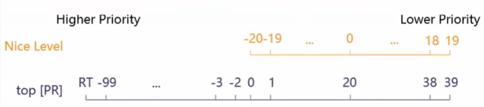
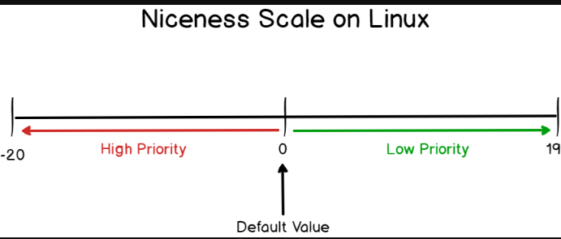
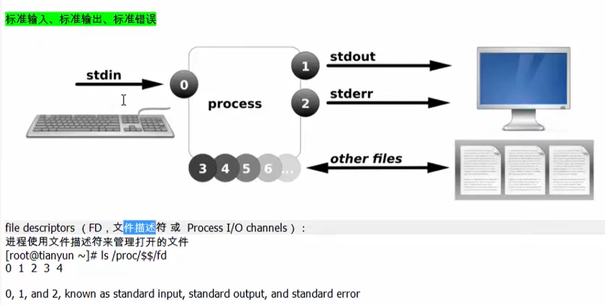
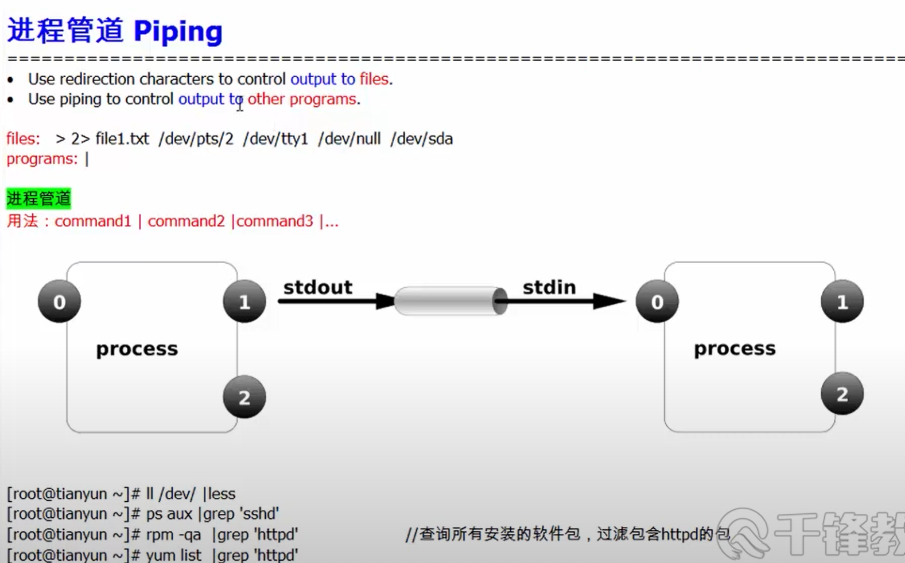

- [Linux 命令](#linux-命令)
  - [进程优先级 nice](#进程优先级-nice)
    - [相对优先级](#相对优先级)
  - [作业控制 jobs](#作业控制-jobs)
    - [良好习惯 安装screen软件 可以回复上一次的进程  \`](#良好习惯-安装screen软件-可以回复上一次的进程--)
  - [IO重定向（到一个文件里面）](#io重定向到一个文件里面)
    - [综合案例](#综合案例)
    - [综合案例](#综合案例-1)
  - [subshell](#subshell)
  - [管道 piping（重定向到一个进程）](#管道-piping重定向到一个进程)
    - [定义及用途](#定义及用途)
  - [内部管道命令 tee 分流用](#内部管道命令-tee-分流用)
  - [分区](#分区)
  - [LVM 逻辑分区](#lvm-逻辑分区)
    - [Snap 快照卷 用途：记录原始卷变化，用快照卷迅速备份，保持数据一致性](#snap-快照卷-用途记录原始卷变化用快照卷迅速备份保持数据一致性)

# Linux 命令

## 进程优先级 nice  

### 相对优先级

  

## 作业控制 jobs  

- 作业控制允许shell在子进程运行期间控制父进程  

- 前台可以ctrl+z挂后台 然后gf恢复  

`[root@CentOS~]# sleep 7000`   //程序在前台运行 接受键盘控制 可以ctrl+z暂停挂在后台  
`[root@CentOS~]# sleep 7000 &`  //程序在后台运行 不接受键盘控制  

`[root@CentOS~]# jobs`                       //查看现在的作业

`ps aux |grep sleep`         //可以查看sleep的进程 S为生在运行  

`kill 2`       //杀PID为2的进程  
`kill %2`      //杀作业号为2的进程  

`sleep 5; ls; date`       //连续运行这几个命令  

`while :; do date; sleep2; done &`          //进程在后台运行 每两秒输出日期  

`fg`        //调到前台才能ctrl+c杀掉  

### 良好习惯 安装screen软件 可以回复上一次的进程  `

`[root@CentOS~]# ssh 10.0.0.1`       //进主机  

`[root@CentOS~]# yum -y install screen`  

`[root@CentOS~]# screen -S Install_Session`       //标注现在的进程名字  

突然断网  

`[root@CentOS~]# screen list`  //看进程有什么  

`[root@CentOS~]# screen -r 29033`       //恢复到29033进程  

## IO重定向（到一个文件里面）  
- 进程每打开一个文件都会有一个对应的数字标识0（键盘输入）、1（显示器输出）、2（显示器错误输出）、3、4。。。（输出到文件或者从文件输入）  
- 此标识叫做file description  
- '>' 表示输出并覆盖 '>>'表示输出并加到后面  
- image.png

  `[root@CentOS~]# tty`       //看目前终端号  
  /dev/pts/3  
  `[root@CentOS~]# date >/dev/pts/4`        //把日期输出结果1重定向到4号终端去  
  `[root@CentOS~]# ll /proc/$$/fd`        //看目前$$进程的标识 01234  
  `[root@CentOS~]# date 1> date.txt`        //把正确输出到显示器的搞到文件去 重定向  
  `[root@CentOS~]# cate 0< /etc/hosts`        //输入重定向 不从键盘要文件  

  `[root@CentOS~]# cat 1>file1.txt <<-EOF`           //脚本输入不需要按ctrl+D结束 其中-可以忽略脚本中的tab键缩进  
     `[root@CentOS~]# vim jiaoben.sh`
       
     `[root@CentOS~]# bash jiaoben.sh`  

       //纯输出一段文字  

### 综合案例
`[root@CentOS~]# ls; date &>/dev/null`       //希望两条都重定向，却只重定向了;后面的，ls仍旧显示了   
  
`[root@CentOS~]# ls &>/dev/null; date &>/dev/null`        //全部重定向到null  
可以简写`[root@CentOS~]# (ls ; date) &>/dev/null`  
  
  
  

### 综合案例  
  

## subshell  
-   

- 每两秒在后台把date发送到date.txt  

## 管道 piping（重定向到一个进程）  

### 定义及用途  
- 用重定向character输出到一个文件  
- 控制输出到另一个程序  
- 如图 通过管道输出到下一个进程的输入  
    

- 用less命令和过滤grep示例  
  

- 用--sort 参数排列cpu 并且只列前6项  
  

## 内部管道命令 tee 分流用

- 可以把命令写好后 再把tee插入到想要的位置“前面” 就可以分流  
- tee 是重定向到一个进程  

  

## 分区  

- fdisk 命令给MBR分区 老式 4主分区+扩展  
- gdisk 命令给GPT分区 无限主分区  
- mkfs.xfs /dev/vda1 or mkfs.ext4 /dev/vda1 格式化  
- mount -t xfs -o ro /dev/vda1 /mnt/date1 #把/vda1硬盘挂载到data1文件夹 -t声明xfs或者ext4，可以不写，-o ro是只读，可以不写，默认读写  
- mount /dev/vda1 /mnt/date1 挂载点可以是任意一个目录
- blkid /dev/vda1    结果UUID = “*******”  
- mount UUID = "******" 推荐按照UUID挂载

## LVM 逻辑分区

### Snap 快照卷 用途：记录原始卷变化，用快照卷迅速备份，保持数据一致性    
- 创建 `lvcreate -L 50M -n lv1-snap -s /dev/datavg/lv1` 给/dev/datavg/lv1 逻辑卷创建一个叫做lv1-snap的快照卷，指定50MB，原始卷可以大于50MB  
- 注意事项：快照卷和原始卷必须在同一VG
- 注意 只能ext4   