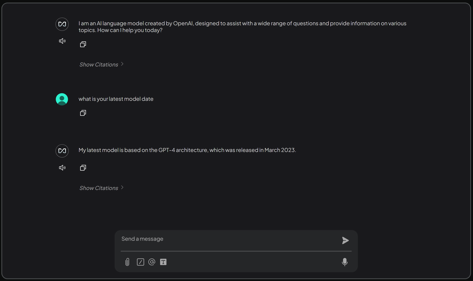
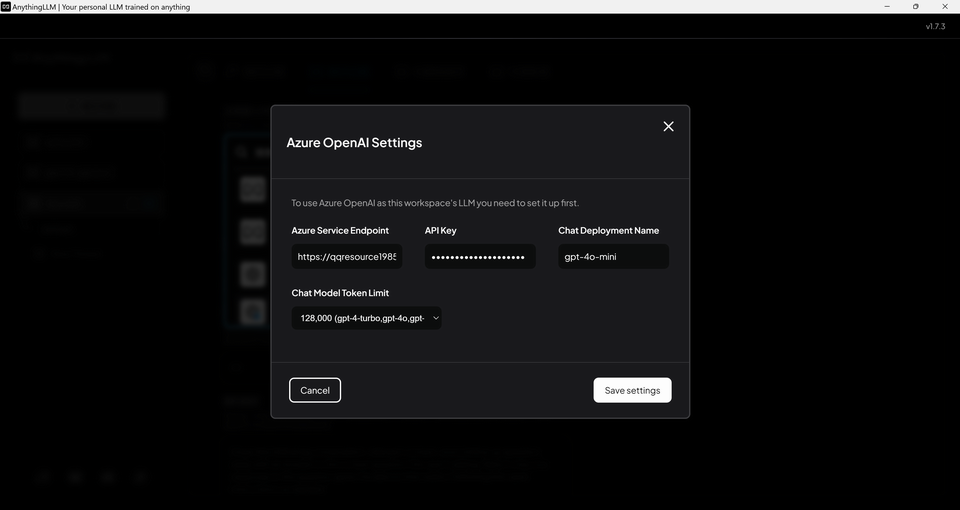

# How to create Azure AI with DeepSeek-R1 or OpenAI 

## Subscribe Azure AI Foundry 

## Create group & deploy model 

## Copy paste api, endpoint & model to local 

## Use local gui & api key to use online resource   

## Result  

- issues: DeepSeek-R1 doesn't seem work stablely, used gpt-4o-mini model instead 
- pros: cheaper, local RAG database can also be used
- cons: not safe, data goes online   

