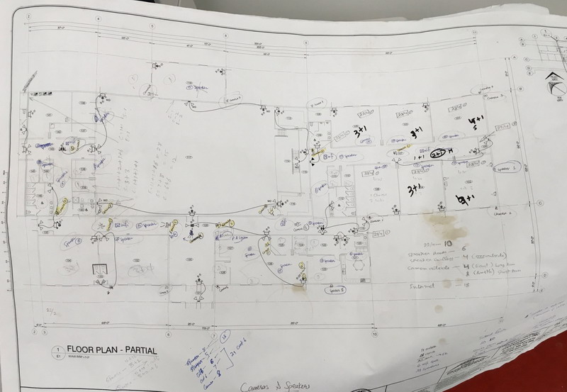
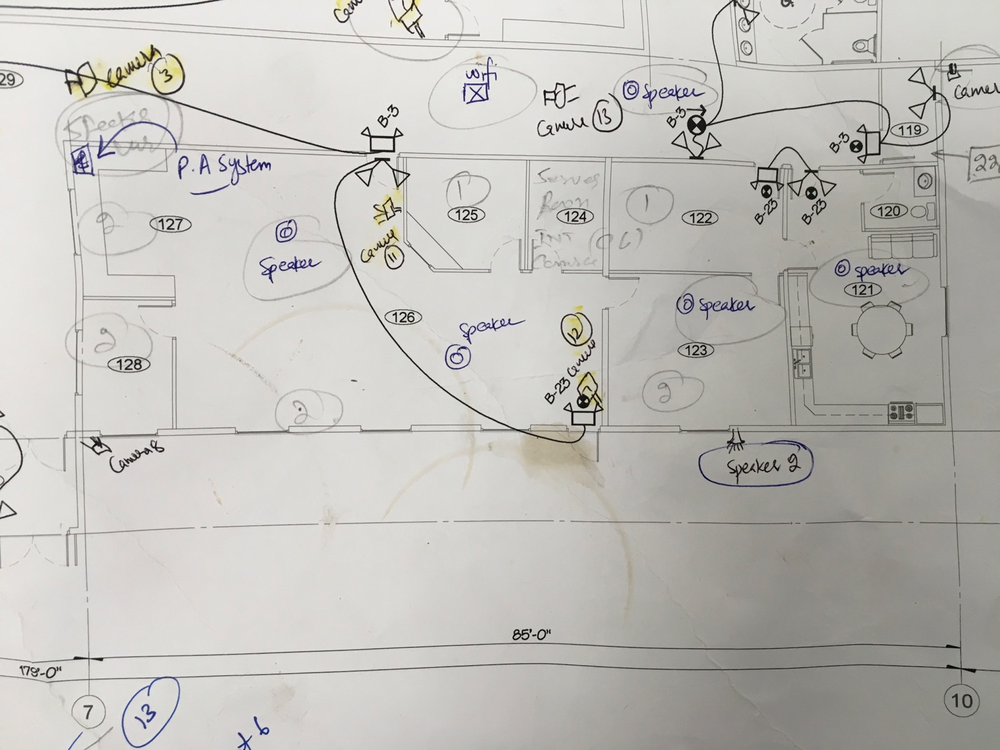
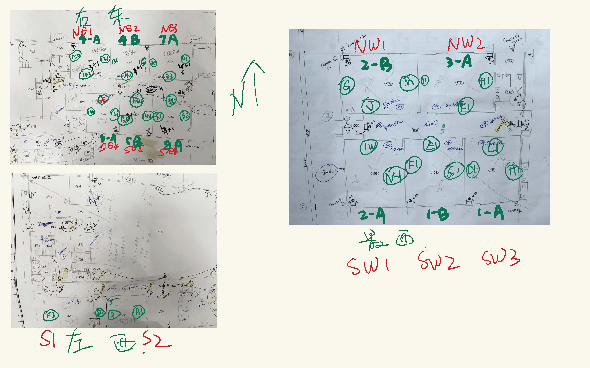
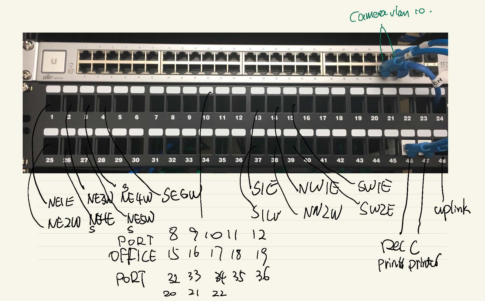

# Build a school from scratch  

## not all contents shown here due to security  

This is a school all network devices project with limited budget. 
- Network: Ubiquiti gateway/controllers/access points, seperated Vlan to reduce noise. 
- Security: Open source Pfsense firewall, Dahua NVR & cameras. 
- Printers: Old Xerox from old school. 
- Windows Servers: AD/DHCP

