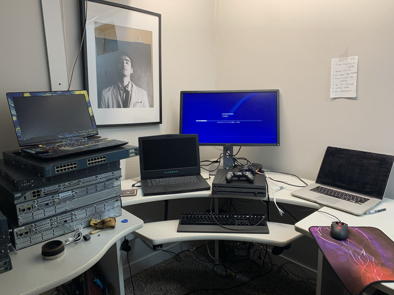
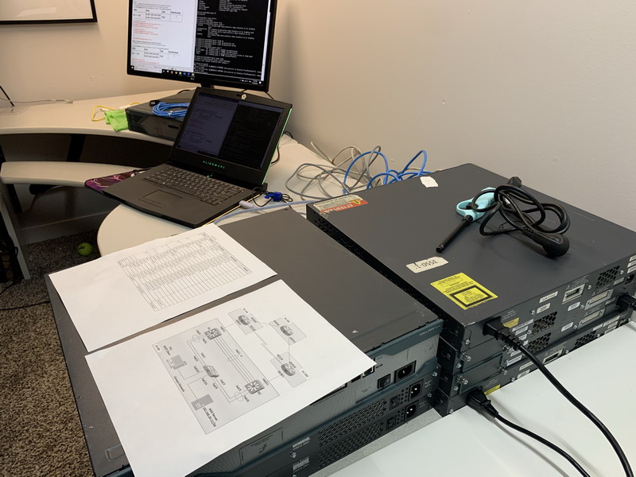
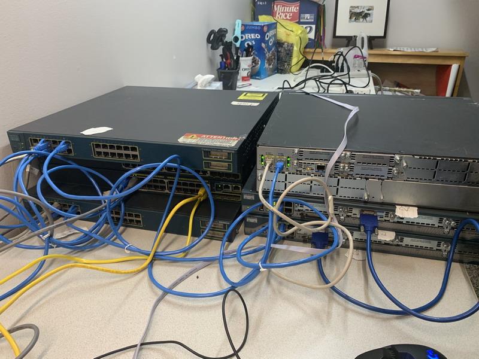

# Build a complex networking project from scratch  

This is a CCNA level project.  

*** Network: ***

- Vlans 
- Trunk 
- EtherChannel 
- IPV4 
- OSPF 
- HSRPv2 
- BGP 
- Static/dynamic routing 

